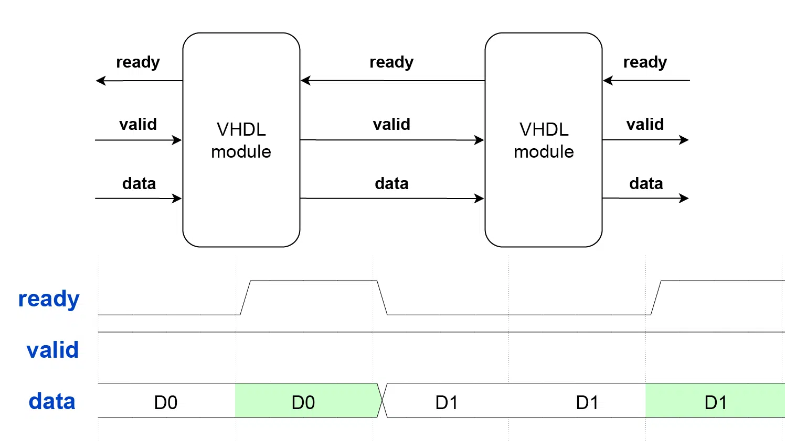

# Microarquitetura Multiciclo (Multi-Cycle)

A microarquitetura multiciclo representa uma evolução significativa em relação ao modelo monociclo. Enquanto no monociclo cada instrução é completamente executada em um único pulso de relógio, o multiciclo divide a execução em múltiplos ciclos, permitindo frequencies de operação mais altas e melhor utilização dos recursos de hardware.

## 1. A Transição: Single-Cycle para Multi-Cycle

### 1.1. Motivação Física: O Problema do Clock

Na arquitetura monociclo, o período do clock é determinado pelo **caminho crítico** — o maior tempo de propagação combinacional ao longo do circuito. Este caminho crítico inclui obrigatoriamente:

1. Leitura da memória de instruções
2. Decodificação e leitura do banco de registradores
3. Execução na ALU
4. Acesso à memória de dados (para loads/stores)
5. Escrita no banco de registradores

Como todas essas etapas devem caber em um único ciclo, o clock deve ser lento o suficiente para acomodar o pior caso. Isso significa que instruções simples (como `ADD` entre registradores) são forçadas a esperar, pois她们的 execução real é muito mais rápida que o tempo total disponível.

**A solução multiciclo:** Ao dividir a execução em etapas menores e balanceadas, cada estágio pode ser completado em um tempo muito menor. O somatório dos estágios resulta em um caminho crítico por estágio significativamente reduzido, permitindo que o processador opere em frequências substancialmente maiores.

### 1.2. Latência de Memória

O modelo monociclo assume implicitamente que as memórias respondem em tempo zero — uma abstração útil para análise, mas irrealista para implementações práticas.

**O problema com memórias reais:**
- Memórias síncronas (block RAMs em FPGAs) tipicamente requerem 1 a 3 ciclos de latência
- Memórias externas (DDR, SRAM) podem exigir dezenas de ciclos
- O modelo monociclo não tolera essa variabilidade sem comprometer a frequência

**A solução multiciclo:**
A arquitetura multiciclo introduz estágios dedicados para acesso à memória. O processador pode "congelar" a FSM em estados de espera até que a memória retorne o sinal de `ready`, mantendo o determinismo da execução sem fixer a frequência do clock à latência máxima de memória.

---

## 2. O Novo Caminho de Dados (Datapath Multiciclo)

A principal diferença visual entre o datapath monociclo e multiciclo é a presença de **registradores de estágio** (pipeline registers) que separam logicamente cada fase da execução:

{ .hero-img }

### 2.1. Registradores de Estágio

No modelo multiciclo, registradores intermediários são introduzidos para reter os resultados entre ciclos de clock para uma mesma instrução:

| Registrador | Sigla | Função |
|-------------|-------|--------|
| **Instruction Register** | `IR` | Armazena a instrução atual durante sua execução |
| **Memory Data Register** | `MDR` | Armazena o dado lido da memória antes do write-back |
| **A / B** | `RS1`, `RS2` | Armazenam os operandos lidos do banco de registradores |
| **ALUOut** | `ALUResult` | Armazena o resultado da ALU entre estágios |
| **OldPC** | `OPC` | Armazena o PC da instrução atual para cálculos relativos |

A implementação no `datapath.vhd` (linhas 157-163) demonstra esses registradores:

```vhdl
signal r_PC             : std_logic_vector(31 downto 0);
signal r_OldPC          : std_logic_vector(31 downto 0);
signal r_IR             : std_logic_vector(31 downto 0);
signal r_MDR            : std_logic_vector(31 downto 0);
signal r_RS1            : std_logic_vector(31 downto 0);
signal r_RS2            : std_logic_vector(31 downto 0);
signal r_ALUResult      : std_logic_vector(31 downto 0);
```

Cada registrador é habilitado por um sinal de controle específico (definidos em `riscv_uarch_pkg.vhd`):

```vhdl
rs1_write   : std_logic;  -- Captura rs1 do banco para o reg interno 'A'
rs2_write   : std_logic;  -- Captura rs2 do banco para o reg interno 'B'
alur_write  : std_logic;  -- Captura resultado da ALU no reg 'ALUOut'
mdr_write   : std_logic;  -- Captura dado da memória no 'MDR'
ir_write    : std_logic;  -- Atualiza o Instruction Register (IR)
```

### 2.2. Reuso de Hardware

Uma das vantagens mais significativas da arquitetura multiciclo é a **reutilização temporal** de recursos. No monociclo,硬件 duplicado é necessário para aumentar paralelismo; no multiciclo, o mesmo hardware pode ser usado em diferentes ciclos para diferentes finalidades.

**Exemplo: A ALU compartilhada**

No monociclo, são necessários somadores dedicados para:
- Calcular `PC + 4` (próxima instrução)
- Calcular `PC + imediato` (endereço de branch/jump)
- Executar operações aritméticas da instrução

No multiciclo, todas essas operações passam pela **mesma ALU** em diferentes ciclos:
- No **IF**: ALU calcula `PC + 4` para atualizar o PC
- No **EX**: ALU executa a operação aritmética da instrução
- No **EX_ADDR**: ALU calcula o endereço de memória para loads/stores

O multiplexer `ALUSrcA` seleciona a entrada correta para cada ciclo:
```vhdl
with Control_i.alu_src_a select
    s_alu_in_a <= r_RS1       when "00",    -- Operando normal (rs1)
                  r_OldPC     when "01",    -- PC para AUIPC
                  x"00000000" when "10",    -- Zero para LUI
                  r_RS1       when others;
```

Da mesma forma, o `ALUSrcB` seleciona entre o registrador `rs2` ou o imediato:
```vhdl
s_alu_in_b <= r_RS2 when Control_i.alu_src_b = '0' else s_immediate;
```

---

## 3. Unidade de Controle e Sincronização

### 3.1. A Máquina de Estados Finita (FSM)

Na arquitetura multiciclo, a Unidade de Controle é implementada como uma **FSM de Moore** — uma máquina de estados finitos onde as saídas dependem exclusivamente do estado atual. O arquivo `main_fsm.vhd` implementa esta FSM, organizada em estados que correspondem às fases lógicas de execução:

{ .hero-img }

#### Estados da FSM

A FSM é definida pelo tipo `t_state` em `main_fsm.vhd:127-134`:

```vhdl
type t_state is (
    S_IF,                                                                        -- IF  (Instruction Fetch)
    S_ID,                                                                        -- ID  (Instruction Decode)
    S_EX_ALU, S_EX_ADDR, S_EX_BR, S_EX_JAL, S_EX_JALR, S_EX_LUI, S_EX_AUIPC,   -- EX  (Execution)
    S_EX_FENCE, S_EX_SYSTEM,
    S_MEM_RD, S_MEM_WR,                                                          -- MEM (Memory Access)
    S_WB_REG, S_WB_JAL, S_WB_JALR                                                -- WB  (Write-Back)
);
```

**Fluxo de Estados:**

1. **S_IF (Instruction Fetch):** 
   - PC é enviado para memória de instruções
   - Instrução é armazenada no IR
   - PC é incrementado para PC+4

2. **S_ID (Instruction Decode):**
   - Instrução é decodificada
   - Registradores rs1 e rs2 são lidos para os registradores A e B
   - Imediato é gerado

3. **S_EX_\* (Execution):**
   - A ALU executa a operação conforme o tipo de instrução
   - Cada variante (ALU, ADDR, BR, JAL, etc.) configura a ALU de forma diferente

4. **S_MEM_RD / S_MEM_WR (Memory Access):**
   - Acesso à memória de dados para loads e stores

5. **S_WB_\* (Write-Back):**
   - Resultado é escrito no registrador de destino

Em uma **FSM do tipo Moore**, os sinais de saída dependem exclusivamente do **estado atual**, e não diretamente das entradas, o que torna o comportamento do controle mais estável e alinhado à divisão do processamento em ciclos bem definidos.

**Tabela Completa de Transição de Estado**

| Estado Atual | Condição   | Próximo Estado | Descrição do Estado                                    | 
| :----------: | :--------: | :------------: | :----------------------------------------------------: | 
| IF           | -          | ID             | Busca instrução e incrementa PC (PC+4)                 | 
| ID           | Tipo-R/I   | EX_ALU         | Decodifica instruções aritméticas/lógicas              | 
| ID           | Load/Store | EX_ADDR        | Decodifica acesso à memória                            | 
| ID           | Branch     | EX_BR          | Decodifica desvio condicional                          | 
| ID           | JAL        | EX_JAL         | Decodifica salto incondicional imediato                | 
| ID           | JALR       | EX_JALR        | Decodifica salto incondicional via registrador         | 
| ID           | LUI        | EX_LUI         | Decodifica carregamento imediato superior              | 
| ID           | AUIPC      | EX_AUIPC       | Decodifica adição de imediato ao PC                    | 
| EX_ALU       | -          | WB_REG         | Operação da ALU concluída. Vai escrever no RegFile     | 
| EX_ADDR      | Load       | MEM_RD         | Endereço calculado. Vai ler da memória                 | 
| EX_ADDR      | Store      | MEM_WR         | Endereço calculado. Vai escrever na memória            | 
| EX_BR        | -          | IF             | Avalia condição (`Zero`) e atualiza PC se necessário   | 
| EX_JAL       | -          | WB_JAL         | Calcula alvo (`OldPC+IMM`) imediatamente               | 
| EX_JALR      | -          | WB_JALR        | Calcula alvo (`rs1+IMM`) e salva em ALUResult          | 
| EX_LUI       | -          | WB_REG         | Soma `0+IMM`. Vai para write-back                      | 
| EX_AUIPC     | -          | WB_REG         | Soma `PC+IMM`. Vai para write-back                     | 
| MEM_RD       | -          | WB_REG         | Lê `DMem[ALUResult]` e atualiza MDR                    | 
| MEM_WR       | -          | IF             | Escreve RS2 em `DMem[ALUResult]`                       | 
| WB_REG       | -          | IF             | Escrita do resultado em `rd`                           | 
| WB_JAL       | -          | IF             | Escreve retorno (`PC+4`) em `rd`. PC já foi atualizado | 
| WB_JALR      | -          | IF             | Escreve retorno (`PC+4`) em `rd`. PC é atualizado      | 

**Tabela Completa de Sinais de Controle**

| Sinal  | Descrição do Sinal de Controle|
| :-: | :-- |
| `PCWrite` | Habilita escrita no `PC`. Permite que o PC seja atualizado apenas em estados específicos (como Fetch ou ao realizar um salto - branch/jump) |
| `OPCWrite` | Atualiza o `OldPC`. Guarda o valor atual do PC no registrador `r_OldPC`. É usado para salvar o endereço da instrução corrente - usando-o para cálculos relativos - atualizado normalmente no estado de Fetch |
| `PCSrc` | Seletor da fonte do próximo `PC`. Controla o multiplexador que define o novo valor do PC. Oppções são: `00` (`PC + 4`); `01` (Branch/JAL); `10` (JALR) |
| `IRWrite` | Habilita a escrita no `IR`. Permite carregar uma nova instrução apenas durante o estado de Fetch. | 
| `MemWrite` | Habilita a escrita na memória. Sinal enviado para a unidade de armazenamento e carga (LSU) para efetuar a gravação de um dado. |
| `ALUSrcA` | Seletor do Operando A da ALU. Opções: `00` (rs1); `01` (PC atual); `10` (zero) |
| `ALUSrcB` | Seletor do Operando B da ALU. Opções: `0` (rs2); `1` (imediato) |
| `ALUControl` | Seletor para a operação da ALU. Define qual operação a ALU deve executar (ADD, SUB, AND etc.) |
| `RegWrite` | Habilita a escrita no banco de registradores. Permite gravar no registrador `rd` durante o estágio de write-back (WB) |
| `WBSel` | Seletor do dado de write-back. Opções: `00` (resultado da ALU); `01` (MDR); `10` (próximo PC) |
| `RS1Write` | Habilita a atualização do regisitrador de RS1. Controla a capatura do valor lido de `rs1` do banco de registradores |
| `RS2Write` | Habilita a atualização do regisitrador de RS2. Controla a capatura do valor lido de `rs2` do banco de registradores |
| `ALUrWrite` | Habilita a atualização do ALUResult. Controla a captura do resultado da ALU |
| `MDRWrite` | Habilita a escrita no MDR. Captura o dado carregado da memória | 

**Tabela Completa de Sinais por Estado**

**Legenda de Sinais**

* **ALUSrcA:** `00`=rs1; `01`=OldPC; `10`=Zero
* **ALUSrcB:** `0`=rs2; `1`=Imediato
* **PCSrc:** `00`=PC+4; `01`=Branch/JAL (Somador Dedicado); `10`=JALR (ALUResult)
* **WBSel:** `00`=ALUResult; `01`=MDR; `10`=PC+4 (Retorno)
* **Cond:** Habilitado apenas se a condição de Branch for satisfeita (Zero flag)
* **ALUControl:** `ADD` (Força Soma); `Funct` (Tipo-R/I); `Branch` (Resolve SUB/SLT/SLTU via funct3)

| Estado  | `PCWrite` | `OPCWrite` | `PCSrc`       | `IRWrite` | `MemWrite` | `ALUSrcA`      | `ALUSrcB`      | `ALUControl` | `RegWrite` | `WBSel`        | `RS1Write` | `RS2Write` | `ALUrWrite` | `MDRWrite` |
| :--- | :---: | :---: | :---: | :---: | :---: | :---: | :---: | :---: | :---: | :---: | :---: | :---: | :---: | :---: |
| **IF** | 1 | 1 | 00 | 1 | 0 | X | X | X | 0 | X | 0 | 0 | 0 | 0 |
| **ID** | 0 | 0 | X | 0 | 0 | X | X | X | 0 | X | 1 | 1 | 0 | 0 |
| **EX_ALU** | 0 | 0 | X | 0 | 0 | 00 | **0/1** | **Funct** | 0 | X | 0 | 0 | 1 | 0 |
| **EX_ADDR**| 0 | 0 | X | 0 | 0 | 00 | 1 | **ADD** | 0 | X | 0 | 0 | 1 | 0 |
| **EX_BR** | **Cond** | 0 | 01 | 0 | 0 | 00 | 0 | **Branch** | 0 | X | 0 | 0 | 0 | 0 |
| **EX_JAL** | 0 | 0 | X | 0 | 0 | X | X | X | 0 | X | 0 | 0 | 0 | 0 |
| **EX_JALR**| 0 | 0 | X | 0 | 0 | 00 | 1 | **ADD** | 0 | X | 0 | 0 | 1 | 0 |
| **EX_LUI** | 0 | 0 | X | 0 | 0 | 10 | 1 | **ADD** | 0 | X | 0 | 0 | 1 | 0 |
| **EX_AUIPC**| 0 | 0 | X | 0 | 0 | 01 | 1 | **ADD** | 0 | X | 0 | 0 | 1 | 0 |
| **MEM_RD** | 0 | 0 | X | 0 | 0 | X | X | X | 0 | X | 0 | 0 | 0 | 1 |
| **MEM_WR** | 0 | 0 | X | 0 | 1 | X | X | X | 0 | X | 0 | 0 | 0 | 0 |
| **WB_REG** | 0 | 0 | X | 0 | 0 | X | X | X | 1 | **00/01** | 0 | 0 | 0 | 0 |
| **WB_JAL** | 1 | 0 | 01 | 0 | 0 | X | X | X | 1 | 10 | 0 | 0 | 0 | 0 |
| **WB_JALR**| 1 | 0 | 10 | 0 | 0 | X | X | X | 1 | 10 | 0 | 0 | 0 | 0 |

### 3.2. Protocolo de Sincronização (Handshake Ready/Valid)

Para tolerar memórias com latência variável, o processador implementa um protocolo de handshake `ready`/`valid` nas interfaces de memória.

!!! note "Hierarquia de Memória"
    O contraste entre BRAM e Memória Distribuída é definido pela latência: a BRAM economiza lógica mas "atrasa" o dado em 1-2 ciclos, enquanto a distribuída (registradores) é instantânea, mas cara em área. O protocolo Ready/Valid amarra essa hierarquia, servindo como o controle de tráfego que impede que a latência de acesso da memória cause perda de dados ou quebre o fluxo do pipeline (throughput) em altas frequências.

#### Interface de Handshake

Em `processor_top.vhd:71-76`:
```vhdl
IMem_rdy_i  : in  std_logic;
IMem_vld_o  : out std_logic;
DMem_rdy_i  : in  std_logic;
DMem_vld_o  : out std_logic;
```

{ .hero-img }

#### FSM e Handshake

A FSM permanece em estados de espera até que a memória sinalize que a transação foi completada:

**Estado S_IF (main_fsm.vhd:215-221):**
```vhdl
when S_IF =>
    -- STALL DE INSTRUÇÃO: Só avança se a memória entregar a instrução
    if imem_rdy_i = '1' then
        next_state <= S_ID;
    else
        next_state <= S_IF;  -- Permanece esperando
    end if;
```

**Estado S_MEM_RD (main_fsm.vhd:297-302):**
```vhdl
when S_MEM_RD => 
    if dmem_rdy_i = '1' then
        next_state <= S_WB_REG;
    else
        next_state <= S_MEM_RD;  -- Stall: fica esperando
    end if;
```

**Estado S_MEM_WR (main_fsm.vhd:305-310):**
```vhdl
when S_MEM_WR => 
    if dmem_rdy_i = '1' then
        next_state <= S_IF;
    else
        next_state <= S_MEM_WR;  -- Stall: fica esperando
    end if;
```

#### Geração de Sinais de Handshake

A FSM também gera os sinais `valid` para indicar ao sistema de memória que o processador está pronto para uma transação:

**Sinais de saída em S_IF (main_fsm.vhd:359-366):**
```vhdl
when S_IF =>
    imem_vld_o     <= '1';
    -- Só atualiza quando o dado chega
    if imem_rdy_i = '1' then
        IRWrite_o  <= '1';
        PCWrite_o  <= '1';
        OPCWrite_o <= '1';
    end if;
```

**Sinais de saída em S_MEM_RD (main_fsm.vhd:533-540):**
```vhdl
when S_MEM_RD =>
    dmem_vld_o <= '1';
    -- Só grava no MDR quando o dado estiver PRONTO
    if dmem_rdy_i = '1' then
        MDRWrite_o <= '1';
    end if;
```

### 3.3. Sinais de Controle

A FSM gera todos os sinais necessários para controlar o datapath:

| Sinal | Descrição |
|-------|------------|
| `PCWrite` | Habilita escrita no PC |
| `OPCWrite` | Atualiza o OldPC |
| `IRWrite` | Habilita escrita no IR |
| `MemWrite` | Habilita escrita na memória de dados |
| `RegWrite` | Habilita escrita no banco de registradores |
| `RS1Write` / `RS2Write` | Captura operandos do banco de registradores |
| `ALUrWrite` | Captura resultado da ALU |
| `MDRWrite` | Captura dado da memória |
| `ALUSrcA` | Seleciona operando A da ALU (rs1, PC, Zero) |
| `ALUSrcB` | Seleciona operando B da ALU (rs2, Imediato) |
| `PCSrc` | Seleciona fonte do próximo PC |
| `WBSel` | Seleciona dado para write-back (ALUOut, MDR, PC+4, CSR) |

---

## 4. Integração no Top-Level

O `processor_top.vhd` do multiciclo apresenta a mesma estrutura de integração que o monociclo, porém com a diferença fundamental de que o Control Path agora é uma FSM em vez de lógica puramente combinacional.

A arquitetura de Harvard Modificada é mantida, com barramentos separados para IMEM e DMEM, permitindo acesso simultâneo a instruções e dados.

### Diferenças Principais entre Single-Cycle e Multi-Cycle

| Aspecto | Single-Cycle | Multi-Cycle |
|---------|--------------|-------------|
| ** clock por instrução | 1 | 2-5 (variável) |
| **Frequência máxima** | Limitada pelo caminho crítico completo | Maior (caminho crítico por estágio) |
| **Unidade de Controle** | Lógica combinacional | FSM sequencial |
| **Recursos de hardware** | Duplicados para paralelismo | Compartilhados no tempo |
| **Registradores intermediários** | Não existem | IR, MDR, A, B, ALUOut, OldPC |
| **Handshake de memória** | Não suportado nativamente | Suportado via Ready/Valid |
| **Complexidade de controle** | Baixa | Média-Alta |

---

## 5. Conclusão

A microarquitetura multiciclo representa um compromisso entre simplicidade de controle (herdada do monociclo) e desempenho (proporcional à frequência de operação). Ao dividir a execução em múltiplos ciclos e reutilizar recursos de hardware no tempo, o processador pode atingir frequencies significativamente mais altas que o monociclo, mantendo uma complexidade controlável.

A implementação do protocolo handshake ready/valid garante que o processador pode funcionar corretamente com memórias reais de latência variável, algo impossível no modelo monociclo.

## Referências

* JENSEN, J. J. How the AXI-style ready/valid handshake works. Disponível em: <https://vhdlwhiz.com/how-the-axi-style-ready-valid-handshake-works/>.
* AMD Technical Information Portal. 7 Series FPGAs Memory Resources. Disponível em: <https://docs.amd.com/v/u/en-US/ug473_7Series_Memory_Resources>.