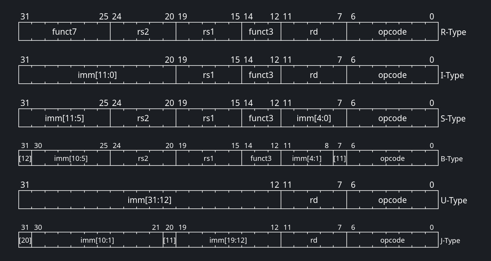
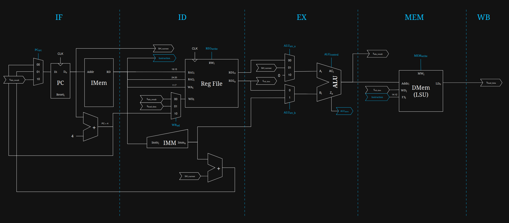

# Microarquitetura Monociclo (Single-Cycle)

A microarquitetura de ciclo único (*Single-Cycle*) é a implementação mais direta e fundamental do processador RISC-V. O seu princípio de funcionamento é simples: **cada instrução é buscada, decodificada e totalmente executada em um único pulso de relógio**.

Embora não seja a abordagem mais eficiente em termos de frequência máxima (devido ao longo caminho crítico), é a base pedagógica perfeita para compreender a interação entre as instruções da ISA RV32I e o hardware digital.

## 1. A Anatomia da Instrução

O núcleo RISC-V (RV32I) processa instruções de 32 bits. Para simplificar a decodificação em hardware, os campos da instrução possuem posições fixas ou altamente regulares. Uma instrução típica de 32 bits é fatiada da seguinte forma:

| Campo | Bits | Descrição | 
 | ----- | ----- | ----- | 
| **`opcode`** | `[6:0]` | Indica a categoria ou formato da instrução (ex: R-Type, I-Type, Load, Store). É o sinal vital para a Unidade de Controle. | 
| **`rd`** | `[11:7]` | Endereço do registrador de destino (*Destination*), onde o resultado da operação será guardado. | 
| **`funct3`** | `[14:12]` | Subcódigo de operação (3 bits) utilizado para diferenciar operações dentro do mesmo `opcode` (ex: distinguir `ADD` de `SUB`, ou tipos de saltos condicionais). | 
| **`rs1`** | `[19:15]` | Endereço do registrador de origem 1 (*Source 1*). | 
| **`rs2`** | `[24:20]` | Endereço do registrador de origem 2 (*Source 2*). | 
| **`funct7`** | `[31:25]` | Subcódigo adicional (7 bits) usado em instruções do tipo R para especificar ainda mais a operação. | 

### 1.1. Formatos de Instruções

Para acomodar diferentes necessidades (operações matemáticas, acessos à memória e saltos), as instruções são divididas em 6 formatos básicos:

- **Tipo-R (Register):** Usado para operações aritméticas e lógicas onde todos os operandos são registradores (ex: `ADD`, `SUB`, `AND`).

- **Tipo-I (Immediate):** Usado para operações com imediatos curtos (12 bits), instruções de Load (leitura de memória) e o salto `JALR`.

- **Tipo-S (Store):** Usado exclusivamente para escrever na memória (ex: `SW`, `SB`). O imediato de 12 bits é dividido em duas partes para manter `rs1` e `rs2` em seus lugares fixos.

- **Tipo-B (Branch):** Usado para saltos condicionais (`BEQ`, `BNE`). Muito semelhante ao Tipo-S, mas o imediato codifica múltiplos de 2 (visto que as instruções são alinhadas na memória).

- **Tipo-U (Upper Immediate):** Usado para carregar imediatos longos (20 bits) nos bits mais significativos de um registrador (`LUI`, `AUIPC`).

- **Tipo-J (Jump):** Usado para saltos incondicionais longos (`JAL`).

{ .hero-img }

## 2. O Gerador de Imediatos (ImmGen)

Ao olhar para os formatos acima, você pode notar que os imediatos (valores constantes embutidos na instrução) nos formatos S, B e J parecem estar "embaralhados". Isso não é um erro; é uma escolha de design intencional.

!!! info "Por que embaralhar os bits?"
    Se o RISC-V mantivesse o imediato contínuo no formato S, os bits referentes ao registrador `rs2` teriam que mudar de lugar. Ao manter `rs1` e `rs2` fixos, o hardware pode começar a ler os registradores do Register File no exato instante em que a instrução chega, sem ter que esperar a Unidade de Controle descobrir qual é o formato da instrução. Isso economiza tempo precioso de hardware!

O ImmGen (Gerador de Imediatos) é o componente de hardware responsável por desembaralhar esses bits e reconstruir o número original de 32 bits. Ele faz isso em duas etapas:

1. **Extração e Reconstrução:** Lendo o `opcode`, o ImmGen sabe qual é o formato da instrução e reconecta os fios (bits) na ordem correta.

2. **Extensão de Sinal:** Como a maioria das operações precisa de 32 bits, o ImmGen copia o bit mais significativo do imediato original (que sempre fica no bit 31 da instrução) para preencher os bits restantes à esquerda, preservando o sinal (positivo ou negativo) em complemento de 2.

## 3. O Caminho de Dados (Datapath)

O Datapath é o "músculo" do processador. É o circuito de potência responsável por rotear os dados, realizar os cálculos e interagir com a memória. Em um processador monociclo, o fluxo de dados atravessa cinco fases lógicas sequenciais dentro do mesmo pulso de clock:

{ .hero-img }

=== "Fetch (Busca)"
    O endereço atual da instrução, armazenado no **Program Counter (PC)**, é enviado para a Memória de Instruções (IMEM). A memória retorna a instrução de 32 bits a ser executada. Ao mesmo tempo, um somador paralelo calcula `PC + 4` para apontar para a próxima instrução sequencial.

=== "Decode (Decodificação)"
    A instrução é fatiada. Os campos `rs1` e `rs2` são enviados ao **Register File** (Banco de Registradores) para ler os operandos. Simultaneamente, o **Gerador de Imediatos (ImmGen)** extrai e estende o sinal de qualquer valor imediato embutido na instrução, formatando-o para 32 bits.

=== "Execute (Execução)"
    A **Unidade Lógica e Aritmética (ALU)** entra em ação. Dependendo da instrução, ela pode calcular operações matemáticas (soma, subtração, lógica AND/OR), calcular endereços de memória para operações de *Load/Store*, ou realizar comparações para instruções de desvio (Branch).

=== "Memory (Acesso à Memória)"
    Se a instrução for um `Load` ou `Store`, o resultado gerado pela ALU é utilizado como endereço para acessar a **Memória de Dados (DMEM)**. Dados são lidos ou escritos neste estágio. Para outras instruções, esta fase é ignorada.

=== "Write-Back (Escrita)"
    O resultado final — seja proveniente da ALU, da Memória de Dados ou do cálculo de um salto — é roteado de volta e escrito no registrador de destino (`rd`) dentro do Register File.

!!! tip "Tempo de Propagação"
    Na arquitetura monociclo (*single-cycle*), toda instrução deve atravessar o *datapath* completo dentro de um único ciclo de clock. Assim, o período mínimo de clock é determinado pelo maior tempo de propagação combinacional ao longo do circuito — o chamado **caminho crítico**. Consequentemente, a frequência máxima do processador fica limitada por esse atraso. Mais adiante será discutido o uso de *pipeline*, que divide o *datapath* em estágios menores para reduzir o comprimento do caminho crítico e permitir frequências de operação mais altas.

### 3.1. Banco de Registradores 

O banco de registradores (Register File) é a estrutura de memória interna mais rápida do processador, composto por 32 registradores de 32 bits, definidos em hardware através do tipo `t_reg_array`. A sua implementação técnica divide-se em abordagens distintas para leitura e escrita:

* **Leitura Assíncrona:** O módulo possui duas portas de leitura independentes (`rs1` e `rs2`) que funcionam de forma puramente combinacional. Assim que os endereços `ReadAddr1_i` ou `ReadAddr2_i` são alterados, os dados correspondentes surgem quase instantaneamente nas saídas `ReadData1_o` e `ReadData2_o`, sem aguardar pelo pulso de clock.
* **Escrita Síncrona:** Diferente da leitura, a atualização de um registrador exige sincronização. A escrita apenas ocorre na transição positiva do sinal de clock (`rising_edge(clk_i)`), e exclusivamente se o sinal de controle `RegWrite_i` estiver ativo (`'1'`).
* **Proteção de Hardware do Registro `x0`:** A convenção da arquitetura RISC-V dita que o registrador `x0` deve conter sempre o valor constante zero. O hardware garante esta regra forçando a saída `x"00000000"` sempre que o endereço de leitura for `"00000"`. Paralelamente, no processo de escrita, existe uma barreira lógica (`WriteAddr_i /= "00000"`) que ignora silenciosamente qualquer tentativa de alteração do registrador zero.

### 3.2. Unidade Lógica e Aritmética

A Unidade Lógica e Aritmética (ULA, ou ALU em inglês) é o motor computacional do processador, operando em conjunto com o seu controlador dedicado.

- **O Controlador da ULA (`alu_control`):** a Unidade de Controle Principal delega a decisão exata da operação matemática ao `alu_control`. Este módulo secundário avalia o sinal `ALUOp_i` de 2 bits (que indica a categoria da instrução) cruzando-o com os campos `Funct3_i` e `Funct7_i`. O resultado é a geração de um sinal de controle otimizado de 4 bits (`ALUControl_o`). Por exemplo, para operações R-Type (`ALUOp_i = "10"`), o módulo verifica o bit 5 do `Funct7_i` para alternar entre uma soma e uma subtração, ou entre deslocamentos lógicos e aritméticos.

- **A Unidade de Execução (`alu`):** o módulo `alu.vhd` é um bloco puramente combinacional que reage imediatamente a qualquer mudança nos operandos `A_i`, `B_i` ou no comando `ALUControl_i`. Suporta um vasto leque de operações, incluindo:

    * **Aritméticas:** Soma e subtração nativas (com tratamento de sinais).
    * **Comparações:** Avaliações de "menor que" com e sem sinal (SLT e SLTU).
    * **Lógicas:** Operações bit-a-bit XOR, OR e AND.
    * **Deslocamentos (Shifts):** Deslocamentos à esquerda (SLL), à direita lógicos (SRL) e à direita aritméticos (SRA).

!!! note "Flag Zero" 
    A par do resultado de 32 bits, a ALU gera continuamente uma flag fundamental: o sinal `Zero_o`. Esta flag assume o valor `'1'` estritamente quando o resultado numérico de toda a operação de 32 bits for igual a zero (`x"00000000"`).

---

### 3.3. Unidade de Branch 

Em muitas arquiteturas clássicas, o cálculo do desvio condicional é fundido na Unidade de Controle Principal. No entanto, este núcleo RISC-V foi desenhado isolando esta responsabilidade na `branch_unit`, tornando o código mais modular e coeso.

Para decidir se o processador deve saltar para um novo endereço de memória, a `branch_unit` correlaciona três sinais de entrada: o sinal que confirma que a instrução é um desvio (`Branch_i`), a flag matemática gerada pela ULA (`ALU_Zero_i`) e o campo `Funct3_i` que dita a regra de salto. 

Com base nisto, a unidade emite o sinal `BranchTaken_o`:

* **BEQ (Branch if Equal):** Requer que os operandos sejam iguais (A - B = 0). O desvio é tomado se `ALU_Zero_i = '1'`.
* **BNE (Branch if Not Equal):** O desvio avança se a subtração gerar um valor diferente de zero (`ALU_Zero_i = '0'`).
* **Outras avaliações:** O módulo aplica lógicas análogas para `BLT`, `BGE`, `BLTU` e `BGEU`, combinando a flag zero resultante de operações `SLT`/`SLTU` executadas pela ALU.

## 4. A Unidade de Controle (Control Path)

Se o Datapath é o músculo, a Unidade de Controle é o cérebro. O seu papel é observar o `opcode`, o `funct3` e o `funct7` da instrução e **emitir os sinais de comando** que configuram os multiplexadores, habilitam as memórias e dizem à ALU o que fazer.

Em vez de declarar dezenas de sinais soltos, o nosso projeto em VHDL utiliza uma abordagem estruturada e elegante através de um `record` VHDL (`t_control`). O pacote `s_ctrl` encapsula todos os sinais diretivos:

* `Branch` / `Jump`: Determinam se o próximo PC será `PC+4` ou um endereço de salto calculado pela ALU.

* `MemRead` / `MemWrite`: Habilitam a leitura ou escrita na Memória de Dados.

* `ALUSrc`: Um seletor de multiplexador que decide se a ALU vai operar com o registrador `rs2` ou com um Imediato estendido.

* `RegWrite`: Habilita a gravação do resultado final no Register File.

* `ResultSrc`: Decide qual dado vai para a fase de Write-Back (resultado da ALU, dado da memória, ou `PC+4`).

!!! info "ALU Control"
    A Unidade de Controle é frequentemente dividida em duas. A Unidade Principal (Main Control) lê o `opcode` e emite um sinal genérico chamado `ALUOp`. Um decodificador secundário (ALU Control) cruza esse `ALUOp` com o `funct3` e `funct7` para gerar o sinal de seleção final da operação da ALU, otimizando o tamanho do hardware gerado.

### 4.1. Sinais de Controle 

| Instrução | `Opcode` | `RegWrite` | `ALUSrc` | `MemtoReg` | `MemRead` | `MemWrite` | `Branch` | `Jump` | `ALUOp` |
| --- | --- | --- | --- | --- | --- | --- | --- | --- | --- |
| `R-TYPE` (**add**, **sub**) | `0110011` | 1 | 0 | 0 | 0 | 0 | 0 | 0 | `10` |
| `LOAD` (**lw**) | `0000011` | 1 | 1 | 1 | 1 | 0 | 0 | 0 | `00` |
| `STORE` (**sw**) | `0100011` | 0 | 1 | X | 0 | 1 | 0 | 0 | `00` |
| `BRANCH` (**beq**) | `1100011` | 0 | 0 | X | 0 | 0 | 1 | 0 | `01` |
| `I-TYPE` (**addi**) | `0010011` | 1 | 1 | 0 | 0 | 0 | 0 | 0 | `00` |
| `JAL` (**jal**) | `1101111` | 1 | X | 0 | 0 | 0 | 0 | 1 | `XX` |
| `JALR` (**jalr**) | `1100111` | 1 | 1 | 0 | 0 | 0 | 0 | 1 | `00` |
| `LUI` (**lui**) | `0110111` | 1 | 1 | 0 | 0 | 0 | 0 | 0 | `00` |
| `AUIPC` (**auipc**) | `0010111` | 1 | 1 | 0 | 0 | 0 | 0 | 0 | `00` |

### 4.2. Operação da ALU

| `ALUOp_i` (Entrada) | `funct7` (Entrada) | `funct3` (Entrada) | `ALUControl_o` (Saída) | Operação da ULA | Motivo |
| --- | --- | --- | --- | --- | --- |
| `"00"` | **X (ignorado)** | **X (ignorado)** | `"0000"` | **ADD** | Para LW/SW/ADDI, a ULA sempre soma. |
| `"01"` | **X (ignorado)** | **X (ignorado)** | `"1000"` | **SUB** | Para Branch, a ULA sempre subtrai para comparar. |
| `"10"` | `0000000` | `000` | `"0000"` | **ADD** | Instrução R-Type: ADD |
| `"10"` | `0100000` | `000` | `"1000"` | **SUB** | Instrução R-Type: SUB |
| `"10"` | `0000000` | `001` | `"0001"` | **SLL** | Instrução R-Type: SLL |
| `"10"` | `0000000` | `010` | `"0010"` | **SLT** | Instrução R-Type: SLT |
| `"10"` | `0000000` | `011` | `"0011"` | **SLTU** | Instrução R-Type: SLTU |
| `"10"` | `0000000` | `100` | `"0100"` | **XOR** | Instrução R-Type: XOR |
| `"10"` | `0000000` | `101` | `"0101"` | **SRL** | Instrução R-Type: SRL |
| `"10"` | `0100000` | `101` | `"1101"` | **SRA** | Instrução R-Type: SRA |
| `"10"` | `0000000` | `110` | `"0110"` | **OR** | Instrução R-Type: OR |
| `"10"` | `0000000` | `111` | `"0111"` | **AND** | Instrução R-Type: AND |
| `"11"` | **X (ignorado)** | **X (ignorado)** | `"XXXX"` | **Indefinido** | Combinação de ALUOp não utilizada. |

## 5. Integração no Top-Level

O arquivo `processor_top.vhd` representa a cápsula mais externa do núcleo RISC-V. Este módulo implementa uma **Arquitetura de Harvard Modificada**, expondo barramentos separados para a Memória de Instruções (IMEM) e para a Memória de Dados (DMEM). Esta topologia permite que a CPU busque a próxima instrução em simultâneo com a leitura ou escrita de dados na memória.

!!! tip "Pipelined"
    A existência de dois barramentos separados - um para instruções e outro para dados - é necessário para viabilizar uma microarquitetura **pipelined**. Apesar de, na **multiciclo**, não apresentar nenhum ganho real.

É neste arquivo que ocorre a união estrutural entre os dois grandes blocos do sistema:

1. **A Comunicação Ascendente (Feedback):** O Datapath (circuito de potência) envia para o Control Path (circuito de comando) a instrução de 32 bits recém-buscada na IMEM (`s_instruction`) e flags cruciais, como a flag matemática de zero (`s_alu_zero`), essencial para resolver os saltos condicionais (*Branches*).

2. **A Comunicação Descendente (Comando):** A Unidade de Controle analisa a instrução e emite o pacote completo de diretrizes através do record `t_control`. Este sinal é injetado de volta no Datapath para orquestrar o ciclo completo.

A união entre o `U_CONTROLPATH` e o `U_DATAPATH` conclui o processador de ciclo único, formando um núcleo coeso capaz de executar o conjunto de instruções RV32I.