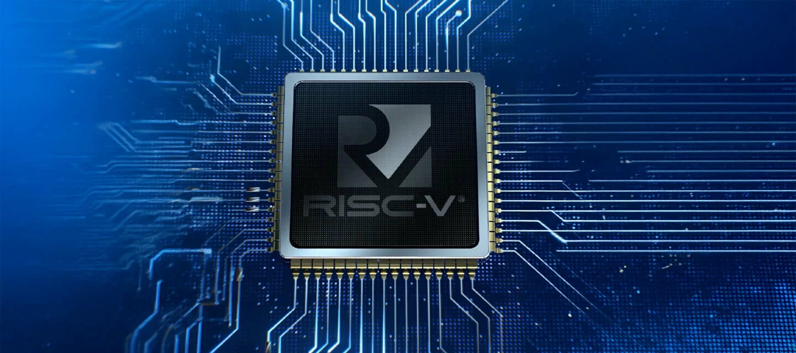

# Visão Geral do Projeto


{ .hero-img }

Bem-vindo à documentação oficial do Processador RISC-V. Este projeto engloba a implementação de um processador de 32 bits baseado na ISA `RV32I_Zicsr`, projetado para suportar múltiplas microarquiteturas. O hardware foi desenvolvido inteiramente em `VHDL-2008`, com um forte foco em clareza, modularidade e propósitos educacionais para o estudo de arquitetura de computadores.

!!! note "RV32I_Zicsr"
    O `RV32I` é o conjunto obrigatório de instruções base de inteiros de 32 bits. A extensão `Zicsr` adiciona a capacidade de ler e escrever nos Control and Status Registers (Registradores de Controlo e Estado). Isso será detalhado na seção dedicada à exceções e interrupções.

## Contextualização

A evolução da computação está intimamente ligada ao design das Arquiteturas de Conjunto de Instruções (ISAs), que definem a interface fundamental entre o software e o hardware. Historicamente, arquiteturas CISC (Complex Instruction Set Computer), dominadas por instruções complexas e de tamanho variável, foram concebidas numa época em que a memória era escassa e cara, o que obrigava os projetistas a transferirem a complexidade semântica para o silício.

Com o tempo e os avanços nos compiladores e nas hierarquias de memória, o paradigma RISC (Reduced Instruction Set Computer) provou ser eficiente e escalável. Focando num conjunto reduzido e altamente otimizado de instruções, as arquiteturas RISC priorizam formatos fixos, decodificação simplificada e adotam um modelo rígido de **load/store**, onde apenas instruções específicas interagem com a memória, enquanto todas as operações lógicas e aritméticas ocorrem estritamente entre os registradores.

!!! note "Load/Store"
    Significa que apenas as instruções de tipo `load` (carregar) e `store` (armazenar) têm a capacidade de acessar e manipular diretamente a memória principal (RAM). A separação das operações de dados das operações de memória permite que a CPU se concentre em realizar cálculos rapidamente, reduzindo a necessidade de acessos frequentes à memória, o que pode melhorar a eficiência e o desempenho geral do processador.

Nesse cenário de evolução, o RISC-V surge como um marco: uma ISA aberta, livre de royalties e desenvolvida de forma colaborativa para evitar o acúmulo de instruções legadas típicas de arquiteturas comerciais mais antigas. Sua filosofia é pautada na extrema modularidade — estabelecendo um conjunto base de instruções de números inteiros obrigatório (como o RV32I) e permitindo a adição de extensões padronizadas (multiplicação, ponto flutuante) ou customizadas pelo projetista. Essa transparência arquitetônica torna o RISC-V a fundação ideal tanto para a pesquisa de ponta quanto para o desenvolvimento de Systems-on-Chip (SoCs) customizados e sistemas embarcados.

A implementação de um processador requer o mapeamento dessa ISA para o hardware físico através de uma **microarquitetura**. Diferentes abordagens microarquiteturais representam trade-offs diretos de engenharia. Organizações monociclo priorizam o Clock Per Instruction (CPI) mínimo, executando cada instrução em um único pulso de relógio, porém limitando severamente a frequência máxima (Clock Rate) devido ao atraso de propagação do caminho crítico. Em contrapartida, organizações multiciclo e com pipeline particionam o fluxo de dados em estágios, permitindo clocks muito mais rápidos e reaproveitamento funcional das unidades lógicas, ao custo de maior complexidade de controle estrutural.

!!! info "A Equação de Desempenho da CPU"
    O tempo de execução de um programa em um processador é regido pela relação matemática entre o software (ISA/Compilador) e o hardware (Microarquitetura/Tecnologia Física).

    $$T_{execução} = N_{instruções} \times CPI \times T_{ciclo}$$

    Onde $N_{instruções}$ é o número de instruções do programa (definido pela ISA RV32I), $CPI$ são os ciclos por instrução (determinado pela microarquitetura escolhida) e $T_{ciclo}$ é o período do relógio (limitado pelo hardware e caminhos críticos).

Em sistemas computacionais modernos, o núcleo de processamento (Core) raramente opera de forma isolada. Ele é integrado em um System-on-Chip (SoC), atuando como o maestro que interage com controladores de barramento, memórias locais (RAM/ROM) e controladores de periféricos. Essa comunicação é tipicamente realizada via MMIO (Memory Mapped I/O), garantindo que a CPU possa gerenciar componentes externos (como UART, GPIO ou aceleradores) utilizando as mesmas instruções load/store utilizadas para acessar a memória padrão.

## Objetivos e Recursos Principais

- **Target ISA:** RISC-V Base Integer Instruction Set (RV32I).
- **Microarquiteturas Flexíveis:** Módulos para implementações Monociclo, Multiciclo e futuro suporte a Pipeline, sem alterar as definições da ISA no core.
- **Design Modular:** Componentes essenciais como ALU, Register File e Control Unit isolados, cada um com seus próprios testbenches auto-verificáveis.
- **Integração de SoC:** Camada completa de integração contendo suporte a Bootloader, interconexões de barramento customizáveis e mapeamento de memória.
- **Periféricos Inclusos:** Controladores de Propósito Geral (GPIO), Comunicação Serial (UART) e Controlador de Vídeo (VGA) nativos.
- **Ecossistema de Verificação e Build:** Infraestrutura altamente automatizada (via Makefile) utilizando o simulador GHDL e testbenches em Python (COCOTB), junto com compilação dinâmica de software C/Assembly (RISC-V GCC).

## Estrutura do Repositório

O design é arquitetado para separar de forma limpa o hardware (RTL), o ambiente de simulação e a compilação do software:

```text
RISC-V/
├── rtl/          # Código VHDL sintetizável (Core, SoC e Periféricos)
├── sim/          # Ambiente de simulação automatizada (Cocotb/Python)
├── fpga/         # Implementação física (Constraints, Scripts Vivado e Upload)
├── sw/           # Softwares (Apps em C/Assembly) e Board Support Package (BSP)
├── pkg/          # Pacotes VHDL globais (Definições da ISA)
├── build/        # Artefatos gerados (.hex, .bin e formas de onda .vcd)
└── mk/           # Sistema de automação modular (Makefiles)
```

!!! tip "Por onde começar?"
    Se você deseja compilar o ecossistema e rodar as primeiras simulações, visite a página de Ferramentas e Setup.