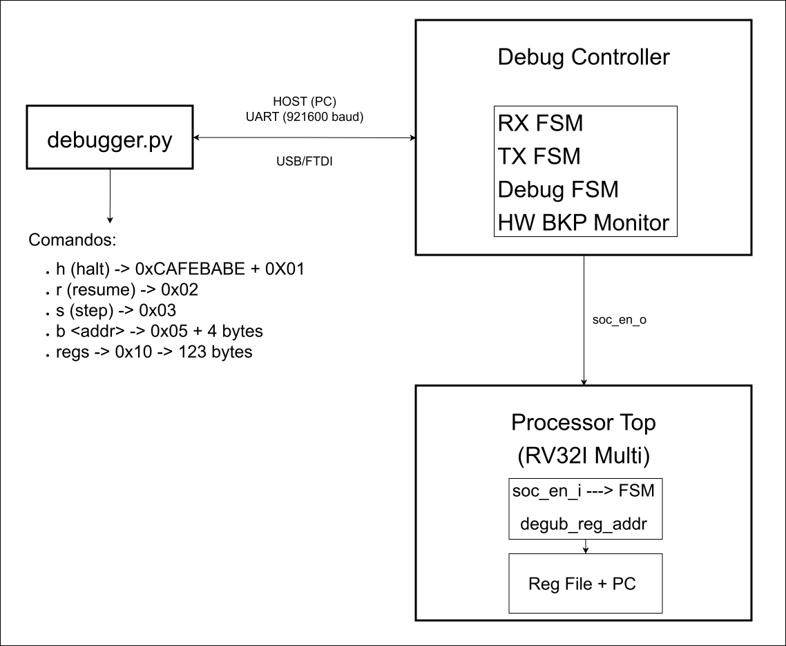

# Controlador de Depuração (Debug Controller)

## 1. Visão Geral

O **Debug Controller** é um módulo de hardware responsável por implementar uma interface de depuração out-of-band para o processador RISC-V. Este componente permite que umhost externo (PC) interaja com o SoC sem intrusão na execução normal do núcleo, possibilitando:

- **Pausa (halt)** e **retomada (resume)** da execução do processador
- **Execução passo a passo (step)** de instruções individuales
- **Leitura do estado interno** (banco de registradores e PC)
- **Hardware breakpoints** com detecção em latência zero
- **Reset controlada** do processador

A arquitetura implementa um modelo de **multiplexação física via RTS** (Request to Send), onde o sinal RTS da UART determina se a comunicação é roteada para o SoC (execução normal) ou para o Debug Controller (modo depuração).

---

## 2. Interface de Comunicação e Protocolo

### 2.1 Multiplexação Física UART (Y-Split)

O Debug Controller utiliza uma técnica de multiplexação física baseada no sinal RTS da UART para determinar o destino dos dados:

```
                    ┌─────────────────┐
    UART_RX_i ──────┤ Y-Split MUX     │──────> CPU (SoC)
                    │                 │
    UART_RTS_i ─────┤◄── RTS=0: SoC   │
                    │◄── RTS=1: Debug│
                    └─────────────────┘
```

**Comportamento do RTS:**
- **RTS = 0 (ativo)**: O canal UART é roteado para o SoC. O Debug Controller ignora comandos recebidos.
- **RTS = 1 (repouso)**: O canal UART é roteado para o Debug Controller. O SoC fica "surdo" (recebe 1 lógico constante).

Implementação em VHDL (`soc_top.vhd:285-290`):

```vhdl
-- Roteamento do RX (Entrada vinda do PC)
-- Se RTS=0, SoC escuta. Se RTS=1, SoC fica surdo ('1' é o estado de repouso da UART).
s_uart_rx_soc   <= UART_RX_i when UART_RTS_i = '0' else '1'; 
s_uart_rx_debug <= UART_RX_i when UART_RTS_i = '1' else '1';

-- Roteamento do TX (Saída para o PC)
UART_TX_o <= s_uart_tx_debug when (UART_RTS_i = '1' or s_soc_en = '0') else s_uart_tx_soc;
```

### 2.2 Sequência de Handshake

Antes de qualquer operação de depuração, o host deve iniciar uma sequência de handshake para ativar o modo debug:

| Passo | Byte | Descrição |
|-------|------|-----------|
| 1 | `0xCA` | Magic byte inicial |
| 2 | `0xFE` | Confirmação protocolo |
| 3 | `0xBA` | Confirmação versão |
| 4 | `0xBE` | Ativação do modo debug |

Quando a FSM principal recebe `0xCA`, ela transita para o estado `WAIT_FE`, awaiting subsequent bytes. Se qualquer byte for incorreto, retorna para `IDLE`.

Implementação (`debug_controller.vhd:329-344`):

```vhdl
when IDLE =>
    r_soc_en <= '1';
    if s_rx_valid = '1' and s_rx_data = x"CA" then dbg_state <= WAIT_FE; end if;
when WAIT_FE =>
    if s_rx_valid = '1' then
        if s_rx_data = x"FE" then dbg_state <= WAIT_BA; else dbg_state <= IDLE; end if;
    end if;
when WAIT_BA =>
    if s_rx_valid = '1' then
        if s_rx_data = x"BA" then dbg_state <= WAIT_BE; else dbg_state <= IDLE; end if;
    end if;
when WAIT_BE =>
    if s_rx_valid = '1' then
        if s_rx_data = x"BE" then dbg_state <= ARMED_WAIT_FETCH; else dbg_state <= IDLE; end if;
    end if;
```

### 2.3 Formato do Protocolo de Comandos

Após a ativação do modo debug, os seguintes comandos estão disponíveis:

| Opcode | Hexa | Função | Payload |
|--------|------|--------|---------|
| `CMD_HALT` | `0x01` | Pausa forçada da CPU | Nenhum |
| `CMD_RESUME` | `0x02` | Retoma execução | Nenhum |
| `CMD_STEP` | `0x03` | Executa 1 instrução | Nenhum |
| `CMD_RESET` | `0x04` | Reset do processador | Nenhum |
| `CMD_SET_BKP` | `0x05` | Configura breakpoint | 4 bytes (endereço) |
| `CMD_CLR_BKP` | `0x06` | Remove breakpoint | Nenhum |
| `CMD_READ_REG` | `0x10` | Dump de registradores | Nenhum |

### 2.4 Máquina de Estados RX (Recepção Serial)

O módulo RX implementa uma UART软件implementada emFSM com amostragem no meio do período de bit:

```
Estados RX: RX_IDLE → RX_START → RX_DATA(8 bits) → RX_STOP
```

- **RX_IDLE**: Aguarda bit de inicio (nível 0)
- **RX_START**: Espera metade do período de bit para sincronização
- **RX_DATA**: Coleta 8 bits de dados (LSB primeiro)
- **RX_STOP**: Confirma bit de parada (nível 1), Valida dados

---

## 3. Controle de Execução (Halt, Resume e Step)

### 3.1 Mecanismo de Pausa Não-Invasiva

O Debug Controller interrompe a execução do processador através do sinal `soc_en_o` (Signal de Enable do SoC), que é conectado à entrada `soc_en_i` do processador:

```
soc_en_o = '1' → CPU executa normalmente
soc_en_o = '0' → CPU pausada (estados congelados)
```

**Comportamento na FSM do Processador** (`main_fsm.vhd:186-197`):

```vhdl
if Reset_i = '1' then
    current_state <= S_IF;
elsif soc_en_i = '1' then
    current_state <= next_state;
    -- Lógica do "Wait State" do Branch
    if current_state = S_EX_BR and s_br_wait_q = '0' then
        s_br_wait_q <= '1';
    elsif current_state /= S_EX_BR then
        s_br_wait_q <= '0';
    end if;
end if;
```

Quando `soc_en_i = '0'`, a FSM simplesmente **não atualiza seu estado**, mantendo o processador congelado no estado atual sem corrupção de estado.

### 3.2 Estratégia ARMED_WAIT_FETCH

Para garantir uma pausa limpa (sem estados intermediários), o Debug Controller utiliza a estratégia de esperar até que o processador atinja a fase de busca de instrução:

```
ARMED_WAIT_FETCH:
    se is_fetch_stage_i = '1' então
        soc_en_o <= '0';
        dbg_state <= DEBUG_ACTIVE;
    senão
        soc_en_o <= '1';
    fim se;
```

- **is_fetch_stage_i**: Sinal indicando que o processador está no estágio de busca de instrução (Fetch)
- Garante que a instrução em andamento seja completada antes da pausa

### 3.3 Execução Passo a Passo (Step)

O comando STEP executa exatamente uma instrução e retorna ao estado pausado:

```
STEP_EXEC:
    soc_en_o <= '1';  -- Libera CPU temporariamente
    se is_fetch_stage_i = '0' então
        dbg_state <= STEP_FETCH;
    fim se;

STEP_FETCH:
    soc_en_o <= '1';
    se is_fetch_stage_i = '1' então
        soc_en_o <= '0';       -- Pausa imediatamente após 1 instrução
        dbg_state <= DEBUG_ACTIVE;
    fim se;
```

### 3.4 Hardware Breakpoint com Latência Zero

O Debug Controller implementa um hardware breakpoint que detecta o endereço do PC de forma combinacional (mesmo ciclo de clock):

**Detecção Comporcional** (`debug_controller.vhd:144-148`):

```vhdl
-- Detecta o endereço combinacionalmente no mesmo ciclo de clock
s_bkp_match <= '1' when (r_bkp_en = '1' and pc_i = r_bkp_addr 
              and is_fetch_stage_i = '1' and r_bkp_bypass = '0') else '0';

-- A CPU é congelada IMEDIATAMENTE (Latência Zero) se houver hit
soc_en_o <= '0' when (r_bkp_hit = '1' or s_bkp_match = '1') else r_soc_en;
```

**Mecanismo de Bypass**: Após um hit de breakpoint, o sistema seta um sinal de bypass para permitir que o PCleave do endereço do breakpoint sem re-trigger:

```vhdl
-- 1. Se recebermos comando para andar, limpa o hit e levanta o escudo (Bypass)
if (dbg_state = DEBUG_ACTIVE and s_rx_valid = '1' and 
   (s_rx_data = CMD_RESUME or s_rx_data = CMD_STEP or 
    s_rx_data = CMD_RESET or s_rx_data = CMD_CLR_BKP)) then
    r_bkp_hit    <= '0';
    r_bkp_bypass <= '1';
end if;

-- 2. Assim que o PC sair do endereço da armadilha, desliga o escudo
if pc_i /= r_bkp_addr then
    r_bkp_bypass <= '0';
end if;
```

---

## 4. Injeção e Inspeção de Estado

### 4.1 Acesso ao Banco de Registradores

O Debug Controller possui uma **porta dedicada de leitura** conectada diretamente ao banco de registradores, funcionando independentemente do datapath normal:

**Interface no Processor Top** (`processor_top.vhd:86-89`):

```vhdl
-- Interface de Debug (Hardware Interlock)
soc_en_i            : in  std_logic;                          -- 1 = Roda normal, 0 = Congela CPU
is_fetch_stage_o    : out std_logic;                          -- Avisa o Debugger que está no Fetch
debug_reg_addr_i    : in  std_logic_vector( 4 downto 0);      -- Endereço do reg para leitura out-of-band
debug_reg_data_o    : out std_logic_vector(31 downto 0)       -- Dado lido do reg
```

**Leitura no Reg File** (`reg_file.vhd:86-87`):

```vhdl
debug_data_o <= x"00000000" when debug_addr_i = "00000" else
                s_registers(to_integer(unsigned(debug_addr_i)));
```

**Multiplexador PC/Registrador**: O Debug Controller trata o PC como registrador virtual indice 32:

```vhdl
-- reg_idx = 32 representa o PC
s_mux_reg_data <= pc_i when reg_idx = 32 else reg_data_i;
```

### 4.2 Fluxo de Dump de Registradores

Para ler todos os registradores, o Debug Controller itera sobre os 32 registradores mais o PC, transmitindo 4 bytes por registrador (little-endian):

```
DUMP_REGS:
    Para cada reg_idx de 0 a 32:
        Transmite byte 0 (bits 7:0)
        Transmite byte 1 (bits 15:8)
        Transmite byte 2 (bits 23:16)
        Transmite byte 3 (bits 31:24)
        Incrementa reg_idx
```

**Tamanho total**: 33 registradores × 4 bytes = **132 bytes**

Implementação (`debug_controller.vhd:377-399`):

```vhdl
when DUMP_REGS =>
    r_soc_en <= '0';
    if s_tx_busy = '0' and r_tx_start = '0' then
        case byte_idx is
            when 0 => r_tx_data <= s_mux_reg_data(7 downto 0);
            when 1 => r_tx_data <= s_mux_reg_data(15 downto 8);
            when 2 => r_tx_data <= s_mux_reg_data(23 downto 16);
            when 3 => r_tx_data <= s_mux_reg_data(31 downto 24);
        end case;
        
        r_tx_start <= '1'; 
        
        if byte_idx = 3 then
            byte_idx <= 0;
            if reg_idx = 32 then
                dbg_state <= DEBUG_ACTIVE;
            else
                reg_idx <= reg_idx + 1; 
            end if;
        else
            byte_idx <= byte_idx + 1; 
        end if;
    end if;
```

### 4.3 Acesso à Memória

O Debug Controller **NÃO** possui acesso direto à memória RAM através do barramento. A arquitetura atual limita a inspeção de memória às seguintes opções:

| Método | Descrição |
|--------|-----------|
| **Dump de registradores** | Leitura do banco de registradores via porta dedicada |
| **Hardware Breakpoint** | Configuração de break em endereço específico |
| **Execução passo a passo** | Inspeção visual progressiva via registradores |

O acesso à memória seria possível através de:
1. **Leitura pelo processador**: Inserção de instruções LOAD via registradores
2. **DMA assistido**: Utilização do controlador DMA para transferência de blocos de memória (funcionalidade não implementada na versão atual)

---

## 5. Diagrama de Arquitetura



---

## 6. Limitações e Trabalhos Futuros

### 6.1 Limitações Atuais

| Limitação | Descrição |
|-----------|-----------|
| **Escrita de registradores** | Não há suporte para write-back de registradores via debug |
| **Acesso à memória** | Não há acesso direto à RAM via Debug Controller |
| **Watchpoints** | Não há suporte para break em modificações de memória |
| **Breakpoints múltiplos** | Apenas 1 hardware breakpoint suportado |
| **Sem单步 instruções compostas** | Step funciona apenas em nucleo single-cycle por instrução |

### 6.2 Possíveis Extensões

- Implementação de porta de escrita dedicada para registradores
- Integração com Bus Arbitrer para acesso à memória durante halt
- Suporte a breakpoints múltiplos via tabela de endereços
- Implementação de watchpoints (detecção de escrita em memória)
- Comunicação via protocolo JTAG (IEEE 1149.1)

---

## 7. Referência de API (Software Host)

### 7.1 Comandos do Debugger Python

Consulte `tools/debugger.py` para a implementação de referência:

```python
# Comandos disponíveis
halt()          # → 0xCAFEBABE + 0x01
resume()       # → 0x02 + RTS=1
step()         # → 0x03
reset()        # → 0x04
set_bkp(addr)  # → 0x05 + 4 bytes (endereço)
clr_bkp()      # → 0x06
get_regs()     # → 0x10 → aguarda 132 bytes
```

### 7.2 Exemplo de Sessão

```
# Iniciar sessão
$ python tools/debugger.py

# Pausar CPU
(-DBG) > h
[+] CPU Interceptada (Modo DEBUG ATIVO)

# Ler registradores
(-DBG) > p
 BANCO DE REGISTRADORES (RV32I)
────────────────────────────────────────────────────────
 x00 (zero) : 0x00000000    │ x01 (ra)  : 0x00000000
 x02 (sp)   : 0x00000000    │ x03 (gp)  : 0x00000000
 ...
────────────────────────────────────────────────────────
 ► PC Atual       : 0x000000A0

# Configurar breakpoint
(-DBG) > b 0x800
[*] Hardware Breakpoint armado em 0x00000800

# Retomar execução
(-DBG) > r

# Quando breakpoint atinge, host recebe notificação 0xBB
```

---
