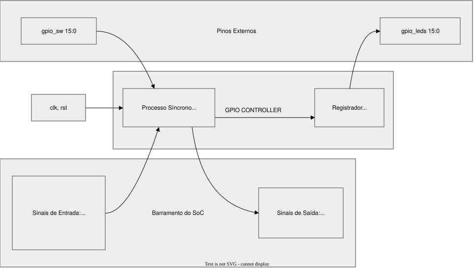
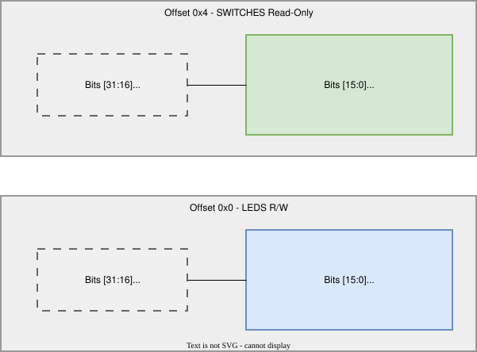
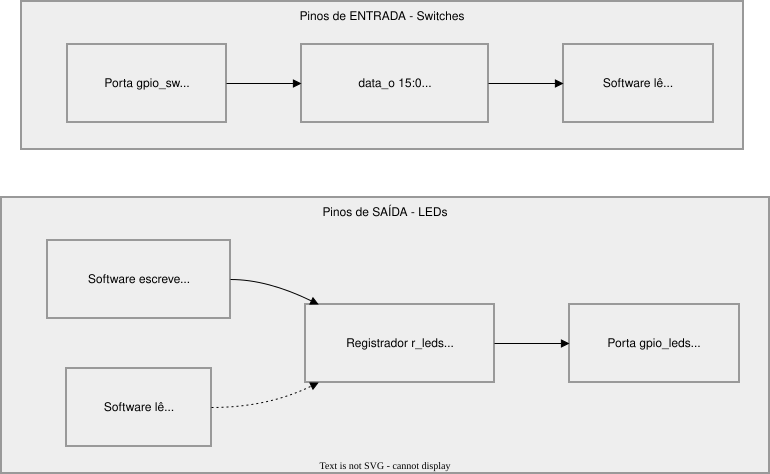
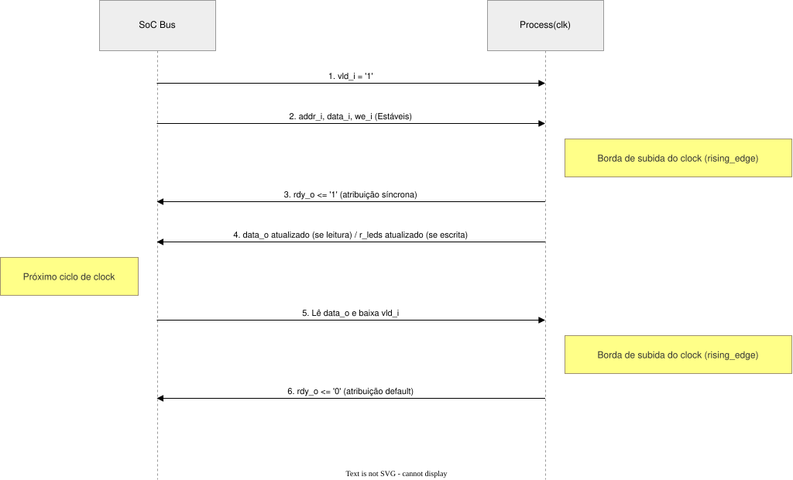

# GPIO Controller - Microarquitetura

---

## 1. Visão Geral

O **GPIO Controller** é um periférico de Entrada/Saída de Uso Geral integrado ao barramento do SoC. Este módulo gerencia a comunicação entre o processador RISC-V e dispositivos físicos externos, especificamente:

- **16 pinos de saída** conectados a LEDs
- **16 pinos de entrada** conectados a chaves (switches)

A arquitetura utiliza um protocolo de handshake para comunicação síncrona com o barramento do sistema, garantindo integridade de dados através de sinais de validade (`vld_i`) e prontidão (`rdy_o`).

---

## 2. Diagrama de Blocos



---

## 3. Mapa de Memória

| Offset | Nome          | Direção | Descrição                              | Acesso  |
|--------|---------------|---------|----------------------------------------|---------|
| `0x0`  | `LEDS`        | R/W     | Registrador de dados dos LEDs         | Leitura/Escrita |
| `0x4`  | `SWITCHES`    | R      | Registrador de estado das chaves      | Somente Leitura |

### Detalhamento dos Registradores



---

## 4. Arquitetura de Registradores

### 4.1 Registrador `r_leds`

**Tipo:** `std_logic_vector(15 downto 0)` - registrador interno  
**Propósito:** Armazenar o estado lógico dos 16 pinos de saída conectados aos LEDs  
**Localização física:** Sinal interno no domínio de clock  

```vhdl
signal r_leds : std_logic_vector(15 downto 0);
```

#### Comportamento

| Condição              | Ação                                      |
|-----------------------|-------------------------------------------|
| `rst = '1'`           | `r_leds <= (others => '0')` (reset)       |
| `vld_i = '1'` E `we_i = '1'` E `addr_i = 0x0` | `r_leds <= data_i(15 downto 0)` |
| Caso contrário        | Mantém valor atual (latched)              |

#### Conexão Física

```vhdl
gpio_leds <= r_leds;  -- Saída combinacional para os pinos físicos
```

A saída `gpio_leds` é uma conexão direta (wire) do registrador, atualizando-se imediatamente quando `r_leds` muda.

### 4.2 Sinal `gpio_sw`

**Tipo:** `std_logic_vector(15 downto 0)` - porta de entrada  
**Propósito:** Refletir o estado físico das 16 chaves (switches) externas  
**Características:** Não é um registrador; é uma leitura direta do hardware externo  

```vhdl
gpio_sw : in std_logic_vector(15 downto 0);  -- declaração na porta
```

#### Fluxo de Dados

```
gpio_sw (pino físico) ──────────────► data_o(15 downto 0) quando addr_i = 0x4
                                      (via multiplexador no processo)
```

### 4.3 Interação Direção Dados

Este módulo implementa uma **separação fixa de direção**:



**Nota:** Este módulo **não possui** um registrador de direção (direction register) como em GPIO tradicionais. A direção é fixa:
- Bits 15:0 dos LEDs → **sempre saída**
- Bits 15:0 dos Switches → **sempre entrada**

---

## 5. Lógica de Interface

### 5.1 Sinais do Barramento

| Sinal    | Direção | Tipo       | Descrição                                      |
|----------|---------|------------|------------------------------------------------|
| `clk`    | Input   | `std_logic`| Clock do sistema (síncrono)                    |
| `rst`    | Input   | `std_logic`| Reset síncrono (ativo alto)                    |
| `vld_i`  | Input   | `std_logic`| Validade: indica transação válida no barramento |
| `we_i`   | Input   | `std_logic`| Write Enable: '1'=escrita, '0'=leitura         |
| `addr_i` | Input   | `slv(3:0)` | Offset do endereço (seleciona registrador)     |
| `data_i` | Input   | `slv(31:0)`| Dados de entrada (escrita da CPU)              |
| `data_o` | Output  | `slv(31:0)`| Dados de saída (leitura para CPU)              |
| `rdy_o`  | Output  | `std_logic`| Ready: indica que o periférico respondeu      |

### 5.2 Decodificação de Endereço

```
addr_i (bits)           Seleção
─────────────────────────────────
0000 (0x0)              Registrador de LEDs (r_leds)
0100 (0x4)              Registrador de Switches (gpio_sw)
outros                  Nenhuma ação (null)
```

---

## 6. Protocolo de Handshake

### 6.1 Descrição

O GPIO Controller implementa um protocolo **handshake com latência 1** para comunicação com o barramento do SoC:



### 6.2 Diagrama de Estados do Handshake


### 6.3 Timing do Handshake

| Ciclo | `vld_i` | `we_i` | `addr_i` | `data_i` | `rdy_o` | Ação |
|-------|---------|--------|----------|----------|---------|------|
| N     | 1       | 0/1    | 0x0/0x4  | valor    | 0       | CPU inicia transação |
| N+1   | 0       | -      | -        | -        | 1       | GPIO responde |
| N+2   | -       | -      | -        | -        | 0       | Idle novamente |

---

## 7. Tabela de Operações Completa

| `vld_i` | `we_i` | `addr_i` | `data_i`     | `data_o`      | `rdy_o` | Ação                                    |
|---------|--------|----------|--------------|---------------|---------|-----------------------------------------|
| 0       | X      | X        | X            | (zera)        | 0       | Nenhuma operação                        |
| 1       | 1      | 0x0      | `xxxx_xxxx`  | (zera)        | 1       | Escrita em `r_leds`                     |
| 1       | 1      | 0x4      | X            | (zera)        | 1       | Escrita ignorada (endereço read-only)   |
| 1       | 1      | Outro    | X            | (zera)        | 1       | Escrita ignorada (endereço inválido)    |
| 1       | 0      | 0x0      | X            | `r_leds`      | 1       | Leitura de LEDs                         |
| 1       | 0      | 0x4      | X            | `gpio_sw`     | 1       | Leitura de Switches                     |
| 1       | 0      | Outro    | X            | (zera)        | 1       | Leitura inválida (retorna 0)            |

---

## 8. Considerações de Projeto

### 8.1 Domínio de Clock

- **Síncrono:** Todos os registradores operam na borda de subida do `clk`
- **Reset:** Síncrono, ativo alto, zera `r_leds` para `0x0000`

### 8.2 Latência

- **Latência de resposta:** 1 ciclo de clock
- A CPU deve aguardar `rdy_o = '1'` antes de considerar a transação completa

### 8.3 Largura de Dados

- Barramento: 32 bits (`data_i`, `data_o`)
- Dados úteis: 16 bits (LSB)
- Bits superiores (31:16): Reservados, retornam 0 em leituras

### 8.4 Limitações

1. **Direção fixa:** Não há registrador de direção configurável
2. **Sem interrupções:** O módulo não suporta geração de interrupções
3. **Sem máscaras individuais:** Escrita afeta todos os 16 bits simultaneamente

---
