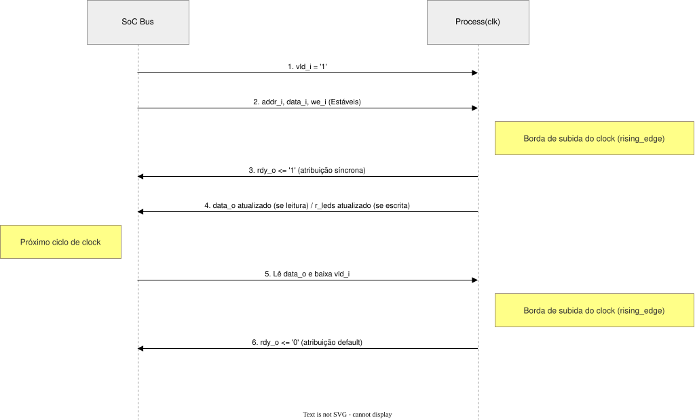

# GPIO Controller - Microarquitetura

---

## 1. Visão Geral

O **GPIO Controller** (`rtl/perips/gpio/`) liga o SoC aos recursos de entrada e saída da placa (Nexys A7 ou Nexys 4). Ele segue o modelo de um microcontrolador: os pinos são agrupados em **portas**, e o software escolhe **a direção de cada pino** e depois lê ou escreve o pino.

| Recurso | Bloco | Detalhe |
| --- | --- | --- |
| Pmods JA, JB, JC, JD | 4 portas de 8 pinos | Entrada ou saída por pino (tri-state), interrupção por borda |
| LEDs LD0..LD15 | Porta de 16 pinos | Só saída |
| Chaves SW0..SW15 | Porta de 16 pinos | Só entrada, com filtro de repique (1 ms) e interrupção |
| Botões BTNU, BTND, BTNL, BTNR | Porta de 4 pinos | Só entrada, com filtro e interrupção (o BTNC é o reset do SoC) |
| 8 displays de 7 segmentos | `seg7_controller` | Varredura em hardware, modo hexadecimal ou segmentos crus |
| LEDs RGB LD16 e LD17 | `rgb_pwm` | PWM de 8 bits por cor, com brilho máximo de 1/8 |

A interrupção do GPIO é a **fonte 4 do PLIC** (`PLIC_SOURCE_GPIO`): o OU das interrupções habilitadas de todas as portas.

## 2. Organização do Hardware

| Arquivo | Função |
| --- | --- |
| `gpio_controller.vhd` | Decodifica o endereço, instancia os blocos e registra a leitura (handshake de latência 1) |
| `gpio_port.vhd` | Uma porta: registradores, sincronização dos pinos, filtro de repique e detecção de borda |
| `seg7_controller.vhd` | Multiplexação dos 8 dígitos, decodificador hexadecimal |
| `rgb_pwm.vhd` | Contador de PWM e comparação com o brilho de cada cor |

No `soc_top`, cada pino de Pmod é um `inout`: ele só é dirigido quando a sua direção é saída; caso contrário fica em alta impedância e pode ser lido. Os pinos de cada placa estão em `fpga/constraints/nexys_a7.xdc` e `nexys4.xdc`.

## 3. Mapa de Memória

O GPIO ocupa `0x2000_0000` a `0x2000_03FF`. Cada bloco ocupa 64 bytes (`addr[9:6]` escolhe o bloco e `addr[5:2]` o registrador).

| Endereço | Bloco |
| --- | --- |
| `0x2000_0000` | Porta JA (Pmod JA) |
| `0x2000_0040` | Porta JB (Pmod JB) |
| `0x2000_0080` | Porta JC (Pmod JC) |
| `0x2000_00C0` | Porta JD (Pmod JD) |
| `0x2000_0100` | Porta LED (LD0..LD15) |
| `0x2000_0140` | Porta SW (SW0..SW15) |
| `0x2000_0180` | Porta BTN (bit 0 = BTNU, 1 = BTND, 2 = BTNL, 3 = BTNR) |
| `0x2000_0200` | Displays de 7 segmentos |
| `0x2000_0280` | LEDs RGB |

### 3.1 Registradores de uma Porta

Os nomes seguem os microcontroladores (MSP430, STM32): `IN`, `OUT` e `DIR` para os dados, e registradores de *set/clear/toggle* atômicos, que mudam só os pinos marcados sem ler-modificar-escrever.

| Offset | Nome | Acesso | Descrição |
| --- | --- | --- | --- |
| `0x00` | `IN` | RO | Estado dos pinos (sincronizado com 2 flip-flops; com filtro nas chaves e botões). Na porta de LEDs, lê `OUT` |
| `0x04` | `OUT` | RW | Valor de saída |
| `0x08` | `DIR` | RW | Direção: bit 1 = saída, 0 = entrada. Fixo em 1 nos LEDs e em 0 nas chaves e botões |
| `0x0C` | `OUTSET` | WO | `OUT <= OUT or valor` |
| `0x10` | `OUTCLR` | WO | `OUT <= OUT and not valor` |
| `0x14` | `OUTTGL` | WO | `OUT <= OUT xor valor` |
| `0x18` | `IE` | RW | Habilita a interrupção de cada pino |
| `0x1C` | `IES` | RW | Borda da interrupção: 0 = subida, 1 = descida |
| `0x20` | `IFG` | RW | Flag de borda de cada pino (marcada mesmo com `IE = 0`); escrever 1 limpa |

Pmods: o bit *i* da porta é o pino *i* do conector na ordem 1, 2, 3, 4, 7, 8, 9, 10 (os pinos 5/11 são GND e 6/12, 3,3 V).

### 3.2 Displays de 7 Segmentos (`0x2000_0200`)

| Offset | Nome | Descrição |
| --- | --- | --- |
| `0x00` | `CTRL` | Bit 0 `RAW`: 0 = modo hexadecimal, 1 = segmentos crus |
| `0x04` | `HEX` | Nibble *i* → dígito *i* (dígito 0 à direita) |
| `0x08` | `RAW_LO` | Segmentos crus dos dígitos 0..3 (byte *i* = dígito *i*) |
| `0x0C` | `RAW_HI` | Segmentos crus dos dígitos 4..7 |
| `0x10` | `DP` | Ponto decimal de cada dígito (modo hexadecimal) |
| `0x14` | `EN` | Dígitos ligados; 0 após o reset (displays apagados) |

Segmentos crus: bit 0 = a, ..., bit 6 = g, bit 7 = ponto; 1 = aceso. O controlador acende um dígito por vez durante 2^14 ciclos (164 µs), o que dá cerca de 760 quadros por segundo.

### 3.3 LEDs RGB (`0x2000_0280`)

| Offset | Nome | Descrição |
| --- | --- | --- |
| `0x00` | `RGB0` | LD16: `0x00RRGGBB`, brilho 0..255 de cada cor |
| `0x04` | `RGB1` | LD17 |

Os LEDs RGB da placa são muito fortes ligados direto, então o PWM tem 2048 passos e o brilho (0..255) cobre só os 256 primeiros: o brilho máximo é 1/8 do LED ligado direto (generic `PWM_DIM = 3`). Cada passo dura 4 ciclos, o que dá cerca de 12 kHz.

## 4. Funcionamento de uma Porta

1. **Sincronização:** os pinos externos passam por dois flip-flops antes de qualquer uso (evita metaestabilidade).
2. **Filtro de repique (chaves e botões):** a cada 1 ms o valor é amostrado; um pino só muda quando duas amostras seguidas concordam.
3. **Borda:** o valor atual é comparado com o do ciclo anterior; a borda escolhida em `IES` marca `IFG`.
4. **Interrupção:** `irq = OU(IFG and IE)`. O tratador lê `IFG`, escreve de volta os bits que tratou (limpando-os) e o PLIC é liberado. Uma borda que chega no mesmo ciclo da limpeza não se perde.

## 5. Uso pelo Software

A HAL fica em `fpga/sw/platform/bsp/hal/hal_gpio.h`:

```c
#include "hal/hal_gpio.h"

hal_gpio_set_dir(GPIO_JA, 0, GPIO_OUTPUT);     // pino 1 do Pmod JA como saída
hal_gpio_write(GPIO_JA, 0, 1);                  // liga o pino
if (hal_gpio_read(GPIO_BTN, GPIO_BTN_UP)) { }   // lê o BTNU

hal_leds_write(0x00FF);                         // LEDs
uint16_t sw = hal_switches_read();              // chaves

hal_seg7_write_dec(1234);                       // displays: 1234
hal_rgb_set(RGB_LD16, 0, 255, 0);               // LD16 verde

hal_gpio_irq_enable(GPIO_BTN, GPIO_BTN_LEFT, GPIO_EDGE_RISING);   // interrupção (PLIC fonte 4)
```

O programa `fpga/sw/tests/gpio_test.c` testa todos os blocos na placa (com autoverificação pela UART) e depois serve de demonstração: os LEDs seguem as chaves, os botões geram interrupções contadas no display e mudam a cor dos LEDs RGB.

## 6. Protocolo de Handshake

O GPIO Controller implementa um protocolo **handshake com latência 1** para comunicação com o barramento do SoC:



| Ciclo | `vld_i` | `we_i` | `rdy_o` | Ação |
|-------|---------|--------|---------|------|
| N     | 1       | 0/1    | 0       | CPU inicia a transação; numa escrita, o registrador é atualizado na borda seguinte |
| N+1   | 0       | -      | 1       | GPIO responde (numa leitura, com o dado registrado) |
| N+2   | -       | -      | 0       | Idle novamente |

## 7. Verificação

O testbench `sim/perips/unit/test_gpio_controller.py` (8 testes) usa o wrapper `sim/perips/wrappers/gpio_controller_wrapper.vhd`, com filtro, varredura e PWM acelerados:

```bash
make test-unit-gpio_controller CORE_ARCH=perips
```

Os testes cobrem o estado de reset, a porta de LEDs, a direção dos Pmods, o filtro das chaves, as interrupções dos botões (borda, `IE`, limpeza de `IFG`), os modos dos displays, o ciclo de trabalho do PWM e 300 operações aleatórias comparadas com um modelo.
