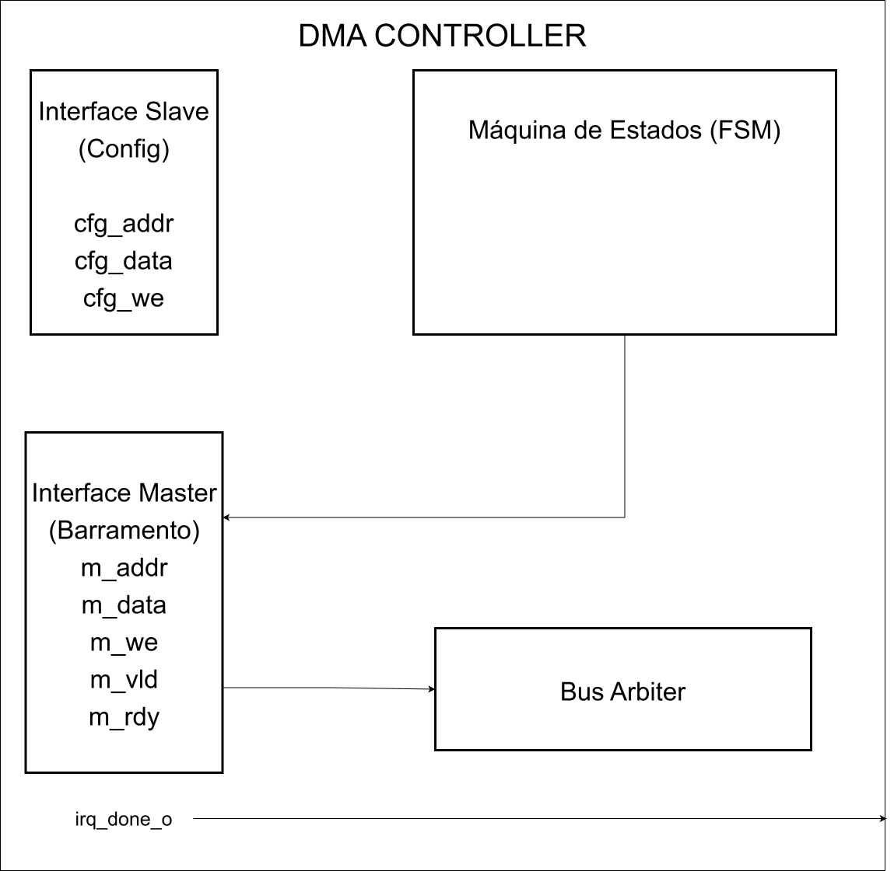
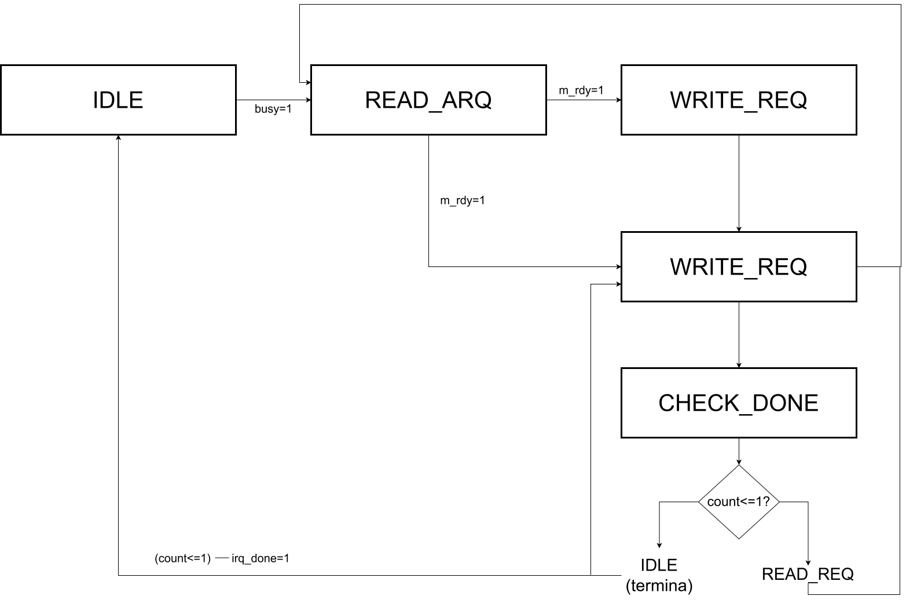
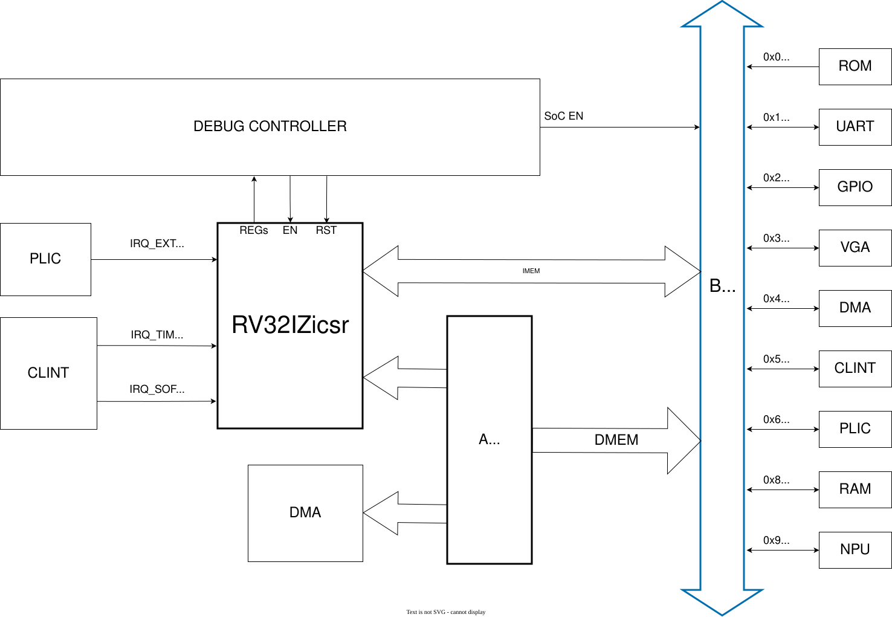

!!! warning Atualizar referência do link para documentação do barramento.

# Organização do Espaço de Memória do SoC RISC-V

## 1. Espaço de Endereçamento

A arquitetura RV32I define um espaço de endereçamento linear de **32 bits**, resultando em **4 GB (2³² bytes)** de memória virtualmente endereçável. Este espaço é dividido em regiões distintas para memórias e periféricos, seguindo o modelo de **Memory-Mapped I/O (MMIO)** onde cada dispositivo é acessado através de endereços de memória específicos.

A organização deste espaço segue as convenções da especificação RISC-V, onde as regiões de memória principal (ROM e RAM) ocupam os extremos inferiores e superiores do mapa, enquanto os periféricos de I/O são mapeados em uma região intermediária.

### 1.1 Mapa de Endereços do SoC

A tabela abaixo apresenta o mapa de endereçamento completo do SoC, detalhando cada região de memória e periférico:

| Nome | Endereço Base | Endereço Final | Tamanho | Descrição |
|------|---------------|----------------|---------|-----------|
| **Boot ROM** | `0x0000_0000` | `0x0000_0FFF` | 4 KB | Memória apenas de leitura de inicialização (bootloader) |
| **Reservado** | `0x0000_1000` | `0x07FF_FFFF` | ~128 MB | Espaço não utilizado |
| **UART** | `0x1000_0000` | `0x1000_FFFF` | 64 KB | Controlador UART (comunicação serial) |
| **GPIO** | `0x2000_0000` | `0x2000_FFFF` | 64 KB | Pinos de entrada/saída geral |
| **VGA** | `0x3000_0000` | `0x3001_FFFF` | 128 KB | Controlador de vídeo (VRAM) |
| **DMA** | `0x4000_0000` | `0x4000_FFFF` | 64 KB | Controlador DMA |
| **CLINT** | `0x5000_0000` | `0x5000_FFFF` | 64 KB | Core Local Interrupt Controller |
| **PLIC** | `0x6000_0000` | `0x6003_FFFF` | 256 KB | Platform-Level Interrupt Controller |
| **Reservado** | `0x7000_0000` | `0x7FFF_FFFF` | 256 MB | Espaço não utilizado |
| **RAM** | `0x8000_0000` | `0x8003_FFFF` | 256 KB | Memória RAM principal |
| **Reservado** | `0x8004_0000` | `0x8FFF_FFFF` | ~255 MB | Espaço não utilizado |
| **NPU** | `0x9000_0000` | `0x9FFF_FFFF` | 256 MB | Neural Processing Unit |

### 1.2 Decodificação de Endereços

A decodificação de endereços é realizada no módulo `bus_interconnect.vhd`, que utiliza os **bits mais significativos (31-28)** do endereço de 32 bits para identificar qual periférico ou memória deve responder à requisição. Esta abordagem permite uma decodificação rápida e simples, utilizando apenas 4 bits para selecionar entre até 16 regiões distintas.

O código VHDL a seguir demonstra a lógica de decodificação implementada:

```vhdl
dmem_slv <= SLV_ROM   when dmem_addr_i(31 downto 28) = x"0" else
            SLV_UART  when dmem_addr_i(31 downto 28) = x"1" else
            SLV_GPIO  when dmem_addr_i(31 downto 28) = x"2" else
            SLV_VGA   when dmem_addr_i(31 downto 28) = x"3" else
            SLV_DMA   when dmem_addr_i(31 downto 28) = x"4" else
            SLV_CLINT when dmem_addr_i(31 downto 28) = x"5" else
            SLV_PLIC  when dmem_addr_i(31 downto 28) = x"6" else
            SLV_RAM   when dmem_addr_i(31 downto 28) = x"8" else
            SLV_NPU   when dmem_addr_i(31 downto 28) = x"9" else
            SLV_NONE;
```

É importante observar que as regiões `0x7` e `0xA` até `0xF` não são utilizadas nesta implementação, servindo como espaço reservado para futuras expansões.

---

## 2. Memórias

O SoC dispõe de duas memórias principais: a **Boot ROM**, que armazena o código de inicialização, e a **RAM principal**, utilizada para execução de programas e armazenamento de dados.

### 2.1 Boot ROM 

A Boot ROM é uma memória apenas de leitura que armazena o bootloader do sistema. Ela é inicializada durante a síntese com o conteúdo de um arquivo HEX externo.

#### Características Técnicas

| Parâmetro | Valor |
|-----------|-------|
| **Tamanho** | 4 KB (2¹⁰ palavras de 32 bits) |
| **Tipo** | Dual-port sincronizada |
| **Porta A** | Fetch de instruções (IMem) |
| **Porta B** | Leituras de dados (DMem) |
| **Inicialização** | Carrega conteúdo de arquivo `.hex` |

#### Interface de Sinais

A Boot ROM oferece duas portas de leitura independentes, permitindo acessos simultâneos:

```vhdl
port (
    clk       : in  std_logic;
    
    -- Porta A: Dedicada ao Fetch (Instruções)
    vld_a_i   : in  std_logic;
    addr_a_i  : in  std_logic_vector(31 downto 0);
    data_a_o  : out std_logic_vector(31 downto 0);
    rdy_a_o   : out std_logic;

    -- Porta B: Dedicada ao LOAD/STORE (Dados)
    vld_b_i   : in  std_logic;
    addr_b_i  : in  std_logic_vector(31 downto 0);
    data_b_o  : out std_logic_vector(31 downto 0);
    rdy_b_o   : out std_logic
);
```

#### Inicialização via Arquivo

A ROM é inicializada através da função `init_rom_from_file`, que lê um arquivo no formato HEX:

```vhdl
impure function init_rom_from_file(file_name : string) return t_rom is
    file     f       : text open read_mode is file_name;
    variable l       : line;
    variable v_data  : std_logic_vector(31 downto 0);
    variable v_rom   : t_rom := (others => (others => '0'));
begin
    for i in 0 to (2**ADDR_WIDTH)-1 loop
        exit when endfile(f);
        readline(f, l);
        hread(l, v_data);
        v_rom(i) := v_data;
    end loop;
    return v_rom;
end function;
```

A síntese em FPGA utiliza atributos específicos do Vivado (Xilinx) para forçar a inferência de Block RAM:

```vhdl
attribute ram_style : string;
attribute ram_style of rom_content : signal is "block";
```

- O atributo `ram_style` é uma sintaxe específica para síntese via Vivado da Xilinx
- O valor `"block"` força a utilização de BRAM (Block RAM) ao invés de distribuição (LUT RAM)
- A utilização de BRAM adiciona **latência de 1 ciclo de clock** à leitura de dados (referência: [UG473 - 7 Series Memory Resources](https://docs.amd.com/v/u/en-US/ug473_7Series_Memory_Resources))

### 2.2 RAM Principal 

A RAM principal é uma memória de leitura e escrita utilizada para armazenamento temporário de dados e código durante a execução do programa.

#### Características Técnicas

| Parâmetro | Valor |
|-----------|-------|
| **Tamanho** | 256 KB (2¹⁶ palavras de 32 bits) |
| **Tipo** | Dual-port com BRAM inferida |
| **Largura de dados** | 32 bits |
| **Escrita** | Byte-a-byte (WE de 4 bits) |
| **Índices de acesso** | `addr(17 downto 2)` (palavras) |

#### Interface de Sinais

```vhdl
generic (
    ADDR_WIDTH : integer := 16;  -- 256 KB
    DATA_WIDTH : integer := 32
);
port (
    clk        : in  std_logic;
    
    -- Porta A
    vld_a_i    : in  std_logic; 
    we_a       : in  std_logic_vector((DATA_WIDTH/8)-1 downto 0);
    addr_a     : in  std_logic_vector(ADDR_WIDTH-1 downto 0);
    data_a_i   : in  std_logic_vector(DATA_WIDTH-1 downto 0);
    data_a_o   : out std_logic_vector(DATA_WIDTH-1 downto 0);
    rdy_a_o    : out std_logic;
    
    -- Porta B
    vld_b_i    : in  std_logic;
    we_b       : in  std_logic_vector((DATA_WIDTH/8)-1 downto 0);
    addr_b     : in  std_logic_vector(ADDR_WIDTH-1 downto 0);
    data_b_i   : in  std_logic_vector(DATA_WIDTH-1 downto 0);
    data_b_o   : out std_logic_vector(DATA_WIDTH-1 downto 0);
    rdy_b_o    : out std_logic
);
```

#### Escrita Byte-a-Byte

A RAM suporta escrita em granularidade de byte através de um vetor de Write Enable:

```vhdl
for i in 0 to (DATA_WIDTH/8)-1 loop
    if we_b(i) = '1' then
        ram(to_integer(unsigned(addr_b)))(8*i+7 downto 8*i) := data_b_i(8*i+7 downto 8*i);
    end if;
end loop;
```

Cada bit do vetor `WE` (4 bits para dados de 32 bits) controla um byte específico, permitindo escrita em 1, 2, 3 ou 4 bytes individualmente.

##### Relação com a LSU e Endianness

O **Load Store Unit (LSU)** é a unidade responsável por formatar os acessos à memória de dados. Ela decodifica o campo `Funct3` das instruções para gerar os Byte Enables corretos:

| Instrução | Tamanho | Byte Enables |
|-----------|---------|---------------|
| `SB` | 1 byte | `"0001"`, `"0010"`, `"0100"` ou `"1000"` |
| `SH` | 2 bytes | `"0011"` (bytes 0-1) ou `"1100"` (bytes 2-3) |
| `SW` | 4 bytes | `"1111"` |

A LSU utiliza os bits menos significativos do endereço (`addr(1:0)`) para determinar qual byte escrever:

```vhdl
-- Store Byte: Seleção por endereço (little-endian)
case s_addr_lsb is
    when "00" => DMem_we_o <= "0001";  -- Byte 0 (bits 7:0)
    when "01" => DMem_we_o <= "0010";  -- Byte 1 (bits 15:8)
    when "10" => DMem_we_o <= "0100";  -- Byte 2 (bits 23:16)
    when "11" => DMem_we_o <= "1000";  -- Byte 3 (bits 31:24)
end case;
```

Este SoC utiliza **endianness little-endian**:
- Endereço com LSB=`00` → byte menos significativo (bits `[7:0]`)
- Endereço com LSB=`11` → byte mais significativo (bits `[31:24]`)

Essa arquitetura permite que o software escreva bytes individuais sem afetar os demais bytes da palavra, essencial para operações de strings e comunicação com periféricos.

---

## 3. Registradores de Periféricos via MMIO

### 3.1 Conceito: MMIO vs CSRs Internos do Core

Existem **duas formas distintas** de comunicação entre software e hardware neste SoC:

#### CSRs Internos do Core (RISC-V Privileged)

São registradores **dentro do núcleo processador** que controlam interrupções, traps e modo de execução. São acessados via instruções CSR dedicadas (`csrrw`, `csrrs`, `csrrc`) e ocupam um espaço de endereçamento separado de 12 bits (endereços `0x300`-`0x344`). Esses registradores fazem parte da arquitetura RISC-V Privileged e são implementados no módulo `csr_file.vhd`.

#### Registradores de Periféricos via MMIO

São registradores **fora do núcleo**, mapeados no espaço de memória endereçável. Cada periférico expõe seus registradores de controle e dados em endereços específicos dentro do mapa de memória. O software acessa esses registradores usando instruções normais de `load` e `store`. Isso vai de encontro à filosofia básica de arquiteturas RISC.

**Esta seção documenta os registradores MMIO dos periféricos.** Para os CSRs internos do core, consulte a [Seção 6: CSRs Internos do Core RISC-V](#6-csrs-internos-do-core-risc-v).

### 3.2 Arquitetura de Acesso a Periféricos

No SoC, periféricos são acessados como posições de memória através de **Memory-Mapped I/O (MMIO)**:

| Intervalo de Endereço | Descrição / Periférico |
| :--- | :--- |
| `0x0000_0000` - `0x0FFF_FFFF` | Memórias (ROM) e Reservado |
| `0x1000_0000` | UART |
| `0x2000_0000` | GPIO |
| `0x3000_0000` | VGA |
| `0x4000_0000` | DMA |
| `0x5000_0000` | CLINT |
| `0x6000_0000` | PLIC |
| `0x8000_0000` | RAM |
| `0x9000_0000` | NPU |

A CPU configura e lê periféricos usando instruções normais de memória:

```c
// Escrita: configurar source address do DMA
DMA_SRC_ADDR = (uint32_t)buffer_src;  // sw do compilador: store

// Leitura: verificar status da UART
status = UART_CTRL;                    // sw do compilador: load
```

### 3.3 BSP: Macros de Acesso

O Board Support Package (BSP) fornece macros para acesso volátil:

```c
#define MMIO32(addr) (*(volatile uint32_t *)(addr))
#define MMIO8(addr)  (*(volatile uint8_t  *)(addr))
```
!!! note
    A palavra-chave `volatile` garante que o compilador não otimize away acessos consecutivos ao mesmo endereço, essencial para registradores de status que mudam de valor.


### 3.4 Tabela Consolidada de Registradores MMIO

A seguir, todos os registradores mapeados em memória de cada periférico do SoC.

---

#### UART (`0x1000_0000`)

Controlador de comunicação serial UART.

| Offset | Nome | Acesso | Descrição |
|--------|------|--------|-----------|
| `0x00` | `DATA` | RW | Registrador de dados TX/RX |
| `0x04` | `CTRL` | RW | Registrador de controle e status |

**Definições de bits do registrador CTRL:**

```c
#define UART_STATUS_TX_BUSY  (1 << 0)   // Transmissor ocupado
#define UART_STATUS_RX_VALID (1 << 1)   // Dado RX disponível
#define UART_CMD_RX_POP      (1 << 0)   // Comando: remover dado
#define UART_CMD_RX_FLUSH    (1 << 2)   // Comando: limpar buffer
```

---

#### GPIO (`0x2000_0000`)

Controlador de pinos de entrada/saída de propósito geral.

| Offset | Nome | Acesso | Descrição |
|--------|------|--------|-----------|
| `0x00` | `DATA` | RW | Leituras de chaves (switches) e escritas nos LEDs |

---

#### VGA (`0x3000_0000`)

Controlador de vídeo VGA com frame buffer de 320x240 pixels.

| Offset | Nome | Acesso | Descrição |
|--------|------|--------|-----------|
| `0x00000` - `0x1FFFC` | `FRAME_BUFFER` | RW | Pixels do frame buffer (24 bits/pixel) |
| `0x1FFFE` | `VSYNC` | RW | Registrador de sincronização vertical |

---

#### CLINT (`0x5000_0000`)

**Core Local Interrupt Controller** - Gerencia interrupções de timer e software localmente.

| Offset | Nome | Acesso | Descrição |
|--------|------|--------|-----------|
| `0x00` | `MSIP` | RW | Machine Software Interrupt Pending |
| `0x08` | `MTIMECMP_LO` | RW | Timer Compare Low (32 bits inferiores) |
| `0x0C` | `MTIMECMP_HI` | RW | Timer Compare High (32 bits superiores) |
| `0x10` | `MTIME_LO` | RW | Timer Value Low |
| `0x14` | `MTIME_HI` | RW | Timer Value High |

O timer de 64 bits é implementado como dois registradores de 32 bits, permitindo contagens superiores a 4 segundos a 100 MHz.

---

#### PLIC (`0x6000_0000`)

**Platform-Level Interrupt Controller** - Gerencia prioridades e roteamento de interrupções externas.

| Offset | Nome | Acesso | Descrição |
|--------|------|--------|-----------|
| `0x000000` | `PRIORITY` | RW | Prioridade das fontes de interrupção (escalável por ID) |
| `0x001000` | `PENDING` | RO | Bitmap de interrupções pendentes (bits 0-31) |
| `0x002000` | `ENABLE` | RW | Habilita interrupções por fonte |
| `0x200000` | `THRESHOLD` | RW | Limiar de prioridade (interrupções abaixo são ignoradas) |
| `0x200004` | `CLAIM` | RW | Claim: lê fonte; Complete: marca como tratada |

---

#### DMA (`0x4000_0000`)

**Direct Memory Access Controller** - Transferência de dados autônoma entre memória e periféricos.

| Offset | Nome | Acesso | Descrição |
|--------|------|--------|-----------|
| `0x00` | `SRC_ADDR` | RW | Endereço de origem (RAM) |
| `0x04` | `DST_ADDR` | RW | Endereço de destino (RAM ou periférico) |
| `0x08` | `COUNT` | RW | Número de palavras de 32 bits a transferir |
| `0x0C` | `CONTROL` | RW | Bits de controle e status |

**Bits do registrador CONTROL:**

| Bit | Nome | Acesso | Descrição |
|-----|------|--------|-----------|
| 0 | START | RW | Escreve 1 para iniciar transferência; hardware limpa ao completar |
| 1 | FIXED_DST | RW | 1 = destino fixo (FIFO mode), 0 = incremento automático |
| 2 | BUSY | RO | 1 = transferência em andamento |

---

#### NPU (`0x9000_0000`)

**Neural Processing Unit** - Acelerador de hardware para operações de redes neurais.

| Offset | Nome | Acesso | Descrição |
|--------|------|--------|-----------|
| `0x00` | `STATUS` | RO | Flags de status (BUSY, DONE, OUT_VLD) |
| `0x04` | `CMD` | WO | Comandos de controle (START, RST_PTRS) |
| `0x08` | `CONFIG` | RW | Dimensão K da matriz |
| `0x10` | `WRITE_W` | WO | Porta de escrita de pesos |
| `0x14` | `WRITE_A` | WO | Porta de escrita de ativações |
| `0x18` | `READ_OUT` | RO | Porta de leitura de resultados |
| `0x40` | `QUANT_CFG` | RW | Configuração de quantização (shift, zero-point) |
| `0x44` | `QUANT_MULT` | RW | Multiplicador PPU |
| `0x48` | `FLAGS` | RW | Flags de controle (ReLU) |
| `0x80` | `BIAS_BASE` | RW | Endereço base do vetor de bias |

**Bits de status (STATUS):**

```c
#define NPU_STATUS_BUSY     (1 << 0)  // Operação em andamento
#define NPU_STATUS_DONE     (1 << 1)  // Operação concluída
#define NPU_STATUS_OUT_VLD  (1 << 3)  // Saída válida disponível
```

**Bits de comando (CMD):**

```c
#define NPU_CMD_RST_PTRS     (1 << 0)  // Reseta ponteiros internos
#define NPU_CMD_START        (1 << 1)  // Inicia execução
#define NPU_CMD_ACC_CLEAR    (1 << 2)  // Limpa acumuladores
#define NPU_CMD_ACC_NO_DRAIN (1 << 3)  // Mantém resultado no array (tiling)
```

---

## 4. Controlador DMA

### 4.1 Gargalo de Desempenho: Transferência por Polling/Busy-Wait

#### O Problema da Cópia por Software

Quando o processador RISC-V executa uma cópia de memória via software (load/store em loop), cada palavra transferida consome ciclos de CPU que poderiam ser utilizados para outras tarefas. Para uma transferência de **256 KB** (tamanho total da RAM principal):

```
Palavras de 32 bits em 256 KB = 262.144 / 4 = 65.536 palavras

Ciclos consumidos por iteração do loop (estimativa realista para multi-cycle):
├── LOAD do endereço fonte:         ~3 ciclos (inclui wait states)
├── STORE no endereço destino:     ~3 ciclos (inclui wait states)
├── Incremento de ponteiros:      ~2 ciclos
└── Atualização de contador:      ~2 ciclos
                                      ──────────
Total por palavra transferida:  ~10 ciclos

Total para 256 KB: 65.536 × 10 ≈ 655.360 ciclos de CPU
```
!!! note "Nota sobre Gargalo de Von Neumann (Memory Wall)"

    A arquitetura RV32I_Zicsr deste SoC é uma **FSM multi-cycle** (não pipeline), onde cada instrução consome múltiplos ciclos de clock. O **memory wall** (gargalo de von Neumann) é o fenômeno onde a velocidade da memória não acompanha a velocidade do processador, criando um limite de desempenho fundamental.

    !!! note 

        Para benchmarks reais de throughput de memória, consulte: [NPU Benchmark](https://risc-v-azedinha.github.io/NPU/hardware/benchmark/) e [Systolic Array](https://risc-v-azedinha.github.io/NPU/hardware/systolic_array/).

Nesta estimativa, consideramos ~3 ciclos por LOAD/STORE, representando wait states típicos em acessos à memória de dados (DMem) com handshake de-ready.

Durante esses aproximadamente **655.000 ciclos**, o processador fica **indisponível** para:

- Processamento de interrupções UART (podendo perder dados)
- Atualização de timers e agendamento
- Manipulação de outros periféricos
- Execução de lógica de aplicação

#### Impacto no Throughput do Sistema

| Cenário | Tempo (100 MHz) | Ciclos CPU | Utilização CPU |
|---------|-----------------|------------|----------------|
| Cópia 256 KB via CPU (busy-wait) | 6,55 µs | 655.360 | 100% |
| Cópia 256 KB via DMA | ~0,65 µs (efetivo) | ~6 | 0% (livre) |

A CPU poderia utilizar esses ~655.000 ciclos economizados para:

- Processar ~3.000 interrupções UART (200 ciclos cada)
- Executar ~80.000 operações aritméticas inteiras
- Atender múltiplas requisições de software

### 4.2 Visão Geral do DMA

O **Direct Memory Access (DMA)** é um controlador que permite transferência de dados entre memória e periféricos **sem intervenção do núcleo de processamento**. Enquanto a CPU configura a transferência, o DMA executa a cópia de dados de forma autônoma, permitindo que o processador execute outras tarefas em paralelo.

O DMA deste SoC opera em **modo 1D (linear)**, transferindo um bloco contíguo de palavras de 32 bits de uma região de memória para outra. A arquitetura dual-interface permite que o DMA seja simultaneamente **slave** (configurado pela CPU) e **master** (acesso autônomo ao barramento).

### 4.3 Microarquitetura do Controlador DMA

O DMA possui uma arquitetura **dual-interface**:

- **Interface Slave (cfg_*)**: Utilizada pela CPU para configurar registradores de controle
- **Interface Master (m_*)**: Utilizada para acessar o barramento de memória de forma autônoma



### 4.4 Registradores de Configuração

Estes registradores estão documentados na [Seção 3.4](#34-tabela-consolidada-de-registradores-mmio). Resumo:

| Offset | Nome | Tamanho | Descrição |
|--------|------|--------|-----------|
| `0x00` | `SRC_ADDR` | 32 bits | Endereço de origem (RAM) |
| `0x04` | `DST_ADDR` | 32 bits | Endereço de destino (RAM ou periférico) |
| `0x08` | `COUNT` | 32 bits | Número de palavras de 32 bits a transferir |
| `0x0C` | `CONTROL` | 32 bits | Bits de controle e status |

#### Detalhamento do Registrador CONTROL

| Bit | Nome | Acesso | Descrição |
|-----|------|--------|-----------|
| 0 | START | RW | Escreve 1 para iniciar transferência; hardware limpa ao completar |
| 1 | FIXED_DST | RW | 1 = destino fixo (FIFO mode), 0 = incremento automático |
| 2 | BUSY | RO | 1 = transferência em andamento |

### 4.5 Máquina de Estados

O DMA implementa uma FSM (Finite State Machine) com os seguintes estados:

```vhdl
type state_type is (
    IDLE,       -- Ocioso, aguardando START
    READ_REQ,   -- Requisição de leitura da origem
    READ_WAIT,  -- Espera intermediária para arbiter
    WRITE_REQ,  -- Requisição de escrita no destino
    CHECK_DONE  -- Verifica se transferência terminou
);
```

#### Diagrama de Estados



#### Descrição dos Estados

**IDLE:** Estado inicial. O DMA aguarda até que a CPU escreva 1 no bit START do registrador CONTROL. Quando ativado, levanta a flag `r_busy` e transita para `READ_REQ` se `r_count > 0`.

**READ_REQ:** Coloca o endereço `r_src_addr` no barramento (`m_addr_o`) e levanta o sinal `m_vld_o` indicando uma requisição de leitura. Permanece neste estado até que `m_rdy_i` seja asserted pelo arbiter. Quando pronto, captura o dado em `m_data_i` para o buffer interno.

**READ_WAIT:** Estado de espera intermediário onde `m_vld_o` é baixado por um ciclo. Esta pausa é necessária para que o bus_arbiter possa sair do estado de travamento (WAIT_M1) e aceitar a nova requisição de escrita no próximo ciclo.

**WRITE_REQ:** Coloca o endereço `r_dst_addr` e o dado do buffer no barramento, levantando simultaneamente `m_vld_o` e `m_we_o`. Aguarda confirmação do arbiter via `m_rdy_i`.

**CHECK_DONE:** Incrementa `r_src_addr` (+4 bytes) e aplica a lógica de destino:
- Se `FIXED_DST = 0`: incrementa `r_dst_addr` (+4 bytes)
- Se `FIXED_DST = 1`: mantém `r_dst_addr` fixo (modo FIFO)

Se `r_count` atingir 1 ou 0, a transferência está completa: transita para IDLE e_assert `irq_done_o`. Caso contrário, retorna para `READ_REQ`.

### 4.6 Modo Destino Fixo (FIFO Mode)

Quando o bit `FIXED_DST` está setado, o endereço de destino permanece constante durante toda a transferência. Este modo é essencial para periféricos com interface FIFO, como a NPU:

```vhdl
if r_ctrl_fixed_dst = '0' then
    r_dst_addr <= r_dst_addr + 4;  -- Incrementa para próximo endereço
else
    -- Mantém destino fixo (FIFO mode)
end if;
```

### 4.7 Exemplo de Uso em Software

#### Transferência Memória-para-Memória

```c
// Transferir 1024 palavras de buf_src para buf_dst
DMA_SRC_ADDR  = (uint32_t)buf_src;    // Endereço de origem
DMA_DST_ADDR  = (uint32_t)buf_dst;    // Endereço de destino
DMA_COUNT     = 1024;                  // 1024 palavras (4 KB)
DMA_CONTROL   = 0x01;                  // START = 1

// Aguardar conclusão via polling
while (DMA_CONTROL & 0x04);  // Espera BUSY=0
```

#### Transferência para NPU (FIFO Mode)

```c
// Enviar pesos para a NPU (endereço fixo)
DMA_SRC_ADDR  = weights_buffer;                    // Endereço dos pesos
DMA_DST_ADDR  = NPU_BASE_ADDR + 0x10;             // WRITE_W da NPU
DMA_COUNT     = K_DIM * K_DIM;                     // K² palavras
DMA_CONTROL   = 0x03;                              // START | FIXED_DST

// Poll ou interrupção quando concluído
while (DMA_CONTROL & 0x04);  // Aguarda BUSY=0

// Iniciar execução da NPU após carregamento
NPU_CMD = NPU_CMD_START;
```

### 4.8 Interação com o Bus Arbiter

O DMA compartilha o barramento de dados com a CPU através de um **bus_arbiter**. Este componente implementa uma política de prioridade fixa onde:

!!! info "Política de Arbitragem: DMA > CPU"
    O DMA possui prioridade fixa sobre a CPU. Quando ambos os mestres solicitam acesso simultâneo, o DMA ganha automaticamente a concessão.

1. **Prioridade DMA**: Se ambos solicitam, DMA ganha a concessão
2. **Espera**: O DMA pode ser pausado a qualquer momento pela CPU (retorno de ready)
3. **READ_WAIT**: Estado introduzido para resolver problema de handshaking onde o arbiter ficava travado entre requisições

### 4.9 Eficiência do Sistema: Liberação do Núcleo RISC-V

#### Análise Comparativa de Ciclos

!!! info "Nota: Modelo Baseline Multi-cycle"
    Esta análise usa um modelo **baseline multi-cycle** baseado na arquitetura real do RV32I_Zicsr, onde LOAD/STORE consomem ~3 ciclos cada (incluindo wait states de memória).

A tabela a seguir compara os recursos consumidos pela CPU entre os dois métodos de transferência:

| Método | Ciclos CPU | Ciclos Totais (DMA) | CPU Disponível |
|--------|------------|---------------------|----------------|
| **Busy-Wait (256 KB)** | 655.360 | 655.360 | 0% |
| **DMA (256 KB)** | ~6 | 655.360 | 99,99% |

**Detalhamento dos ciclos de CPU com DMA:**
```
Configuração:        4 writes × 1 ciclo    =     4 ciclos
Poll/Interrupção:   ~2 verificações × 1   =     2 ciclos
                                              ─────────
Total CPU:                                      ~6 ciclos
```

#### Otimização do DMA vs CPU Multi-cycle

!!! info "DMA vs CPU"
    Enquanto o modelo multi-cycle da CPU requer ~10 ciclos para uma operação de LOAD seguida de STORE (incluindo overhead), a DMA realiza a mesma transferência através de sua FSM dedicada em apenas ~4 ciclos por palavra, representando uma redução de **~60%** nos ciclos de transferência.

| Componente | Estados FSM | Ciclos/Palavra | Observação |
|------------|-------------|----------------|------------|
| **DMA** | READ_REQ → READ_WAIT → WRITE_REQ → CHECK_DONE | ~4 | Sem fetch de instruções |
| **CPU** | LOAD + STORE + overhead | ~10 | Com fetch+execute+wb |

O DMA é otimizado para transferências massivas de dados pois:
1. Não gasta ciclos com fetch de instruções
2. Não precisa write-back em registradores
3. FSM dedicada com transição contínua entre palavras

#### Ganho de Eficiência

Para uma transferência de **256 KB**:

```
Ciclos economizados   = 655.360 - 6 = 655.354 ciclos
Taxa de liberação     = 655.354 / 655.360 × 100 ≈ 99,999%
```

#### Oportunidades de Paralelismo

!!! info "Interrupções com e sem DMA"
    Interrupções são mecanismos de hardware que desviam a execução para um handler especial, independente do método de transferência de dados. Com ou sem DMA, interrupções são atendidas (a menos que explicitamente desabilitadas via `mstatus.MIE`). A diferença é que, sem DMA, a CPU fica em busy-wait e não pode executar outras tarefas úteis durante a transferência.

Com o DMA em operação, a CPU pode executar **concorrentemente**:

1. **Processamento de dados anteriores** — já processa o bloco N-1 enquanto o bloco N é transferido
2. **Execução de código útil** — não fica bloqueada em loop de cópia
3. **Tarefas de controle** — lógica de aplicação continua executando

```
Tempo ─────────────────────────────────────────────────────────────────────►

CPU:   [Config DMA][ Poll ][Processa][Processa][Processa][Processa]
                │       │         │         │         │         │
DMA:            [ ══════════════ 256KB ══════════════ ] [Done]
                │       │                   │         │         │
                └───────┴───────────────────┴─────────┴─────────┘
                        ~6 ciclos               ~655.000 ciclos livres

RESULTADO: CPU livre para executar outras ~655.000+ instruções
```

#### Resumo: Benefícios Arquiteturais do DMA

| Aspecto | Sem DMA | Com DMA |
|---------|---------|---------|
| **Ciclos CPU (256 KB)** | 655.360 | ~6 |
| **Disponibilidade da CPU** | 0% durante cópia | 99,99% |
| **Latência outras tarefas** | Bloqueadas | Executam em paralelo |
| **Throughput do barramento** | Competição impossível | Arbiter gerencia |
| **Perda de interrupções** | Alta probabilidade | Mínima |

---

## 5. Arquitetura do Sistema de Barramentos

### 5.1 Visão Geral da Interconexão

O SoC implementa uma arquitetura de barramentos hierárquica com três canais distintos:

1. **Canal de Instruções (IMem):** Acesso exclusivo à memória de instruções (ROM/RAM)
2. **Canal de Dados (DMem):** Acesso a memória e periféricos via arbiter
3. **Canal CSR:** Acesso dedicado aos registradores de controle do processador

Esta separação permite que fetch de instruções e acessos a dados ocorram simultaneamente, aumentando o throughput do sistema.

### 5.2 Topologia de Barramentos



### 5.3 Bus Arbiter

O **bus_arbiter** resolve conflitos entre CPU e DMA no canal de dados, implementando arbitragem baseada em prioridades fixas:

!!! info "Política de Arbitragem: DMA > CPU"
    O DMA possui **prioridade fixa sobre a CPU**. Quando ambos os mestres solicitam acesso simultâneo, o DMA ganha a concessão automaticamente.

####Máquina de Estados (FSM)

```
IDLE ─────► GRANT_M1 ─────► WAIT_M1 ─────► IDLE
   │           │              │
   └──────────► GRANT_M0 ─────► WAIT_M0 ◄──┘
```

| Estado | Descrição |
|--------|-----------|
| **IDLE** | Nenhum mestre acessando. Monitora requisições. Se ambos solicitam, DMA ganha. |
| **GRANT_M1** | Concessão para DMA. Roteia sinais do DMA para o escravo. |
| **GRANT_M0** | Concessão para CPU. Roteia sinais da CPU para o escravo. |
| **WAIT_M1/M0** | Espera de segurança. Aguarda o mestre baixar o sinal Valid antes de liberar. |

####Algoritmo de Arbitragem

```vhdl
-- IDLE: Prioridade DMA > CPU
if m1_vld_i = '1' then
    next_state <= GRANT_M1;   -- DMA solicita: aloca para DMA
elsif m0_vld_i = '1' then
    next_state <= GRANT_M0;   -- CPU solicita: aloca para CPU
end if;
```

### 5.4 Bus Interconnect

O **bus_interconnect** realiza a decodificação de endereços e roteamento de dados. Para cada requisição:

1. Extrai os bits de seleção de periférico (31-28)
2. Identifica o slave correspondente
3. Roteia os sinais de endereço, dados e controle
4. Multiplexa o dado de resposta ao master

!!! info Mais informações sobre o barramento em [Barramento: Mestres e Escravos ](https://url.com).


