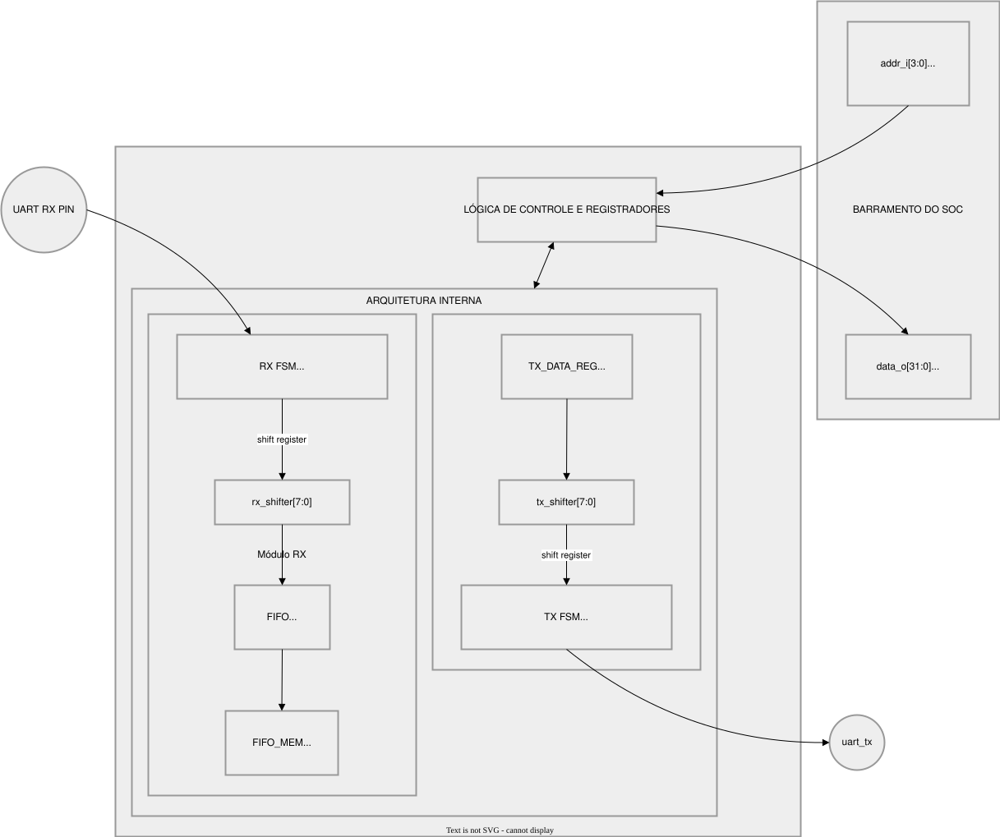

# UART Controller - Microarquitetura

---

## 1. Visão Geral

O **UART Controller** é um periférico de comunicação serial assíncrona que implementa as funções de **Transmissor (TX)** e **Receptor (RX)** em um único módulo de hardware.

### 1.1 Características Principais

| Característica | Valor |
|----------------|-------|
| **Padrão** | UART (Universal Asynchronous Receiver-Transmitter) |
| **Formato de Frame** | 8N1 (8 bits de dados, sem paridade, 1 stop bit) |
| **Baud Rate Padrão** | 921.600 bps |
| **Frequência de Clock** | 100 MHz (configurável) |
| **Buffer de Recepção** | FIFO de 64 bytes (configurável) |
| **Interrupções** | Geradas quando dados estão disponíveis na FIFO |

---

## 2. Teoria do Protocolo UART

### 2.1 Estrutura do Frame UART



---

### 2.2 Componentes do Frame

| Componente | Descrição | Nível Lógico |
|------------|-----------|--------------|
| **Start Bit** | Marca o início da transmissão | `0` (Space) |
| **Data Bits** | Dados úteis (8 bits, LSB primeiro) | `0` ou `1` |
| **Stop Bit** | Marca o fim da transmissão | `1` (Mark) |
| **Idle** | Linha em repouso | `1` (Mark) |

### 2.3 Baud Rate (Taxa de Transmissão)

```
Baud Rate = Bits por segundo (bps)
Exemplo: 921.600 baud = 921.600 bits/segundo

Tempo por bit = 1 / 921.600 = 8,68 µs/bit
```

---

## 3. Diagrama de Blocos


---

## 4. Mapa de Memória

### 4.1 Registrador DATA (Offset 0x0)

| Operação | Comportamento |
|----------|---------------|
| **WRITE** | Escreve byte na latch TX. Se `TX_BUSY = 0`, inicia transmissão automaticamente |
| **READ** | Lê byte na cabeça da FIFO (operação **peek** - não remove da fila) |

### 4.2 Registrador STATUS (Offset 0x4)

| Bit | Nome | Direção | Descrição |
|-----|------|---------|-----------|
| 0 | TX_BUSY | Leitura | `1` = Transmissor ocupado, `0` = Livre |
| 1 | RX_VALID | Leitura | `1` = FIFO contém dados, `0` = FIFO vazia |
| 2 | FLUSH | Escrita | `1` = Limpa toda a FIFO |

### 4.3 Sequências de Uso

**Transmissão (TX):**
```c
while (STATUS & TX_BUSY);     // Aguardar TX livre
DATA = byte_to_send;         // Inicia transmissão
```

**Recepção (RX):**
```c
while (!(STATUS & RX_VALID)); // Aguardar dados
byte = DATA;                  // Ler (peek)
STATUS = RX_POP;             // Avançar fila
```

---

## 5. Geração de Baud Rate

### 5.1 Cálculo do Período de Bit

O hardware utiliza um **divisor de frequência** para gerar o Baud Rate:

```vhdl
constant c_bit_period : integer := CLK_FREQ / BAUD_RATE;
```

**Cálculo para 115200 baud @ 100 MHz:**

```
CLK_FREQ   = 100.000.000 Hz (100 MHz)
BAUD_RATE  = 115.200 bps

c_bit_period = 100.000.000 / 115.200
             = 868 ciclos (arredondado)
```

### 5.2 Equação Geral

```
Período de 1 bit (ciclos) = ⌊ CLK_FREQ ÷ BAUD_RATE ⌋
Período de 1 bit (ns)     = c_bit_period × (1 / CLK_FREQ)
```

| Baud Rate | CLK_FREQ | c_bit_period | Tempo/bit |
|-----------|----------|--------------|-----------|
| 115.200 | 100 MHz | 868 | 8,68 µs |
| 57.600 | 100 MHz | 1736 | 17,36 µs |
| 9.600 | 100 MHz | 10417 | 104,17 µs |

---

## 6. Transmissor (TX)

### 6.1 Arquitetura do TX

O transmissor UART é composto por três elementos principais que trabalham em conjunto para realizar a serialização dos dados. O **TX Data Latch** é um registrador de entrada que armazena temporariamente o byte a ser transmitido quando a CPU escreve no registrador de dados. Este latch mantém o dado estável enquanto a máquina de estados inicia o processo de transmissão. O **TX FSM (Finite State Machine)** é a unidade de controle que gerencia todo o fluxo de transmissão, transitando entre os estados IDLE, START, DATA e STOP. A FSM controla o temporizador de bits e o registrador de deslocamento, garantindo que cada bit seja transmitido com a duração correta. O **Shift Register (tx_shifter[7:0])** é um registrador de deslocamento de 8 bits que contém o byte a ser transmitido. A cada período de bit, a FSM desloca o registrador para a direita, alimentando o pino uart_tx_pin com o bit menos significativo (LSB first). O shift register é carregado com o byte do TX Data Latch no início da transmissão e é deslocado bit a bit até que todos os 8 dados sejam transmitidos, seguido pelo stop bit.

### 6.2 Máquina de Estados TX

A máquina de estados do transmissor opera em quatro estados distintos:

- **TX_IDLE**: Estado de repouso. O pino uart_tx_pin permanece em nível alto (idle) e a flag tx_busy_flag é desativada. O hardware aguarda a escrita de um novo byte no registrador de dados para transitar para TX_START.

- **TX_START**: Início do frame. O pino uart_tx_pin é forçado para nível baixo (espaço). O temporizador de bits é carregado com c_bit_period - 1 e inicia a contagem. A duração deste estado é de exatamente um período de bit.

- **TX_DATA**: Transmissão de dados. Os 8 bits são serializados individualmente. A FSM mantém este estado por 8 períodos de bit. Ao final de cada período, o registrador de deslocamento atualiza o pino de saída e incrementa o índice bit_idx até atingir 7, transitando então para TX_STOP.

- **TX_STOP**: Fim do frame. O pino uart_tx_pin retorna ao nível alto (marcador). A duração é de um período de bit. Após a conclusão, a FSM retorna a TX_IDLE, liberando o transmissor para um novo ciclo.

---

## 7. Receptor (RX)

### 7.1 Desafios da Recepção Assíncrona

1. **Clock Domain Crossing (CDC):** O sinal `uart_rx_pin` vem de fora do domínio de clock
2. **Sincronização de Tempo:** O receptor deve amostrar os bits **no centro** de cada período

### 7.2 Sincronizador Cross-Domain (2-FF)

O receptor UART enfrenta um desafio fundamental de design relacionado ao cruzamento de domínios de clock (CDC - Clock Domain Crossing). O pino de entrada uart_rx_pin é um sinal assíncrono que vem de fora do SoC, potencialmente gerado por outro dispositivo com seu próprio domínio de clock. A conexão direta desse sinal aos flip-flops do domínio de clock do receptor pode causar metastabilidade, um fenômeno em que o flip-flop pode entrar em um estado indefinido quando a transição do sinal de entrada ocorre muito próximo à borda de clock.

A solução implementada utiliza um sincronizador de dois flip-flops (2-FF synchronizer). Este circuito consiste em dois flip-flops em cascata que funcionam como um registrador de dois estágios. O primeiro flip-flop (FF1) captura o sinal assíncrono na borda de clock, mas pode potencialmente entrar em estado metastável se a transição coincidir com a borda de clock. O segundo flip-flop (FF2) captura a saída do primeiro flip-flop na próxima borda de clock, período suficiente para que qualquer metastabilidade no primeiro flip-flop se resolva para um estado válido. A saída do segundo flip-flop (rx_pin_sync(1) ou rx_bit_val) é então um sinal sincronizado que pode ser usado com segurança dentro do domínio de clock do receptor.

A implementação em VHDL utiliza um registrador de deslocamento de 2 bits que é atualizado a cada borda de clock: rx_pin_sync <= rx_pin_sync(0) & uart_rx_pin. O bit mais significativo (rx_pin_sync(1)) representa o valor sincronizado do pino de entrada, que é então utilizado pela máquina de estados do receptor.

### 7.3 Máquina de Estados RX

A máquina de estados do receptor opera em quatro estados, com uma lógica adicional para evitar leituras falsas causadas por ruído:

- **RX_IDLE**: Estado de repouso. O receptor monitora o pino sincronizado rx_bit_val. A detecção de uma transição de alto para baixo (rx_bit_val = '0') aciona a transição para RX_START.

- **RX_START**: Validação do start bit. A FSM aguarda metade de um período de bit (c_bit_period / 2) para amostrar novamente o pino. Se o sinal retornar para alto, assume-se ruído e a FSM volta a RX_IDLE. Se continuar em baixo, o start bit é confirmado e a FSM avança para RX_DATA.

- **RX_DATA**: Recepção de dados. A FSM processa a captura ao longo de 8 períodos de bit. Ao final de cada período de bit no receptor (que se alinha com o centro do bit do transmissor), o valor de rx_bit_val é inserido no registrador rx_shifter através de deslocamento à esquerda.

- **RX_STOP**: Fim da recepção. Após um período de bit completo desde o último dado, o pino é amostrado. O nível alto confirma a presença do stop bit e aciona o sinal de escrita na FIFO (w_wr_en = '1'). Independentemente da amostra, a FSM retorna imediatamente para RX_IDLE visando capturar o próximo frame.

---

## 8. Oversampling e Amostragem no Centro do Bit

### 8.1 O Problema

Sinais UART estão sujeitos a:
- **Ruído elétrico** (interferência eletromagnética)
- **Distorção de borda** (bordas não são perfeitamente verticais)
- **Jitter** (variações no tempo de chegada)

### 8.2 A Solução: Amostragem no Centro

A estratégia de amostragem no centro do bit é fundamental para a robustez do receptor UART. A fundamentação teórica baseia-se na observação de que, durante a transmissão de um bit, as bordas de transição (início e fim do período) são regiões onde o sinal está mais suscetível a ruído, distorção e incertezas de temporização. O centro do período de bit é onde o sinal está mais estável, pois já houve tempo suficiente para o transceptor remoto completar sua transição e ainda não começou a transição para o próximo bit.

Na prática, o receptor utiliza o timer de bits para determinar o momento exato de amostragem. O timer incrementa a cada ciclo de clock e, quando atinge o valor zero (indicando o fim de um período de bit), o valor do pino sincronizado é amostrado e deslocado para dentro do registrador de deslocamento. Esta abordagem resulta em amostragem no final de cada período de bit, que corresponde ao centro do período de bit seguinte (da perspectiva do transmissor), garantindo a posição ideal de amostragem.

Para o start bit especial, a lógica é ajustada: em vez de esperar o final do período, o receptor amostra após metade do período (c_bit_period / 2). Esta amostragem antecipada permite validar se o start bit é genuíno (permanece em baixo) ou é ruído (retorna a alto rapidamente).

### 8.3 Cálculo do Ponto de Amostragem

**Para 115200 baud @ 100 MHz (c_bit_period = 868):**

```
Ponto de amostragem do Start Bit = c_bit_period / 2 = 868 / 2 = 434 ciclos

Código VHDL:
    if rx_timer < (c_bit_period / 2) - 1 then
        rx_timer <= rx_timer + 1;
    else
        if rx_bit_val = '0' then rx_state <= RX_DATA;
        else rx_state <= RX_IDLE;  -- Ruído
        end if;
    end if;
```

---

## 9. FIFO de Recepção

### 9.1 Arquitetura

A FIFO de recepção é uma estrutura de buffer circular que desacopla a taxa de recepção dos dados da taxa de consumo pela CPU, eliminando a necessidade de polls constante e permitindo a recepção de dados em rajadas. A arquitetura implementa um buffer circular com apontadores de cabeça (write pointer - r_head) e cauda (read pointer - r_tail), ambos como índices de 6 bits para uma FIFO de 64 posições.

O **write pointer (r_head)** aponta para a próxima posição vazia onde um novo byte recebido será armazenado. Quando um byte chega do receptor (w_wr_en = '1'), ele é escrito na posição atual do r_head, e então o apontador é incrementado módulo 64. O **read pointer (r_tail)** aponta para o próximo byte a ser lido pela CPU. Quando a CPU lê o registrador de dados (operação de peek), o byte em r_tail é apresentado na saída sem modificar o apontador. Somente quando a CPU escreve no registrador de status com o comando de pop (bit 0), o r_tail é incrementado, efetivamente removendo o byte da fila.

A **contagem de itens (r_count)** mantém o número atual de bytes válidos na FIFO. Este contador é incrementado em uma escrita (se a FIFO não estiver cheia) e decrementado em um pop (se a FIFO não estiver vazia). As flags de status w_fifo_full e w_fifo_empty são derivadas diretamente deste contador para indicar as condições de buffer cheio e buffer vazio, respectivamente.

### 9.2 Flags de Status

```vhdl
w_fifo_full  <= '1' when r_count = FIFO_DEPTH else '0';
w_fifo_empty <= '1' when r_count = 0 else '0';
```

### 9.3 Contador de Itens

```vhdl
if w_wr_en = '1' and w_rd_en = '0' and w_fifo_full = '0' then
    r_count <= r_count + 1;
elsif w_wr_en = '0' and w_rd_en = '1' and w_fifo_empty = '0' then
    r_count <= r_count - 1;
end if;
```

---

## 10. Interface de Barramento

### 10.1 Protocolo de Handshake

A interface de barramento implementa um protocolo de handshake simples com sinais de válido (vld_i) e pronto (rdy_o). O fluxo de operação é o seguinte: quando a CPU deseja escrever ou ler do UART, ela configura os sinais de endereço (addr_i), dados (data_i), write enable (we_i) e configura vld_i para nível alto. Na próxima borda de clock, a lógica de controle do UART detecta vld_i = '1', executa a operação solicitada (escrita no registrador de dados, escrita no registrador de comandos ou leitura de registrador) e, no ciclo seguinte, asserta rdy_o = '1' para indicar conclusão. A CPU então detecta rdy_o = '1', pode remover vld_i e proceder com a próxima operação. Este protocolo garante que a CPU e o periférico estejam sincronizados, evitando condições de corrida e garantindo que cada operação seja completada antes que uma nova seja iniciada.

### 10.2 Mapeamento de Operações

| addr_i | we_i | Operação | Ação |
|--------|------|----------|------|
| 0x0 | 1 | WRITE DATA | Se `TX_BUSY=0`: inicia transmissão |
| 0x0 | 0 | READ DATA | `data_o(7:0) <= r_fifo(r_tail)` (peek) |
| 0x4 | 1 | WRITE CMD | `data_i(0)=1`: pop; `data_i(2)=1`: flush |
| 0x4 | 0 | READ STATUS | `data_o(0)<=TX_BUSY`, `data_o(1)<=RX_VALID` |

### 10.3 Interrupção

#### 10.3.1 O Sinal de Interrupção

O UART possui um pino de saída dedicado para interrupções: `irq_o`. Este pino é conectado ao controlador de interrupções do processador (como o PLIC em sistemas RISC-V), que por sua vez notifica a CPU quando o periférico precisa de atenção.

**Resumo das características:**
- **Nome do sinal:** `irq_o`
- **Direção:** Saída (UART → CPU)
- **Polaridade:** Ativo em nível alto (`1` = interrupção ativa)

#### 10.3.2 Tipo de Gatilho

O UART utiliza **interrupção por nível (level-triggered)**. Isso significa que o sinal permanece ativo (`1`) enquanto a condição que gerou a interrupção existir, e desativa automaticamente quando a condição deixa de existir.

**Comparação rápida:**

| Tipo | Comportamento | Quando usar |
|------|---------------|-------------|
| **Level-triggered** | Permanece ativo enquanto condição existir | Condições que podem mudar rapidamente |
| **Edge-triggered** | Ativa apenas na transição 0→1 | Eventos únicos e instantâneos |

#### 10.3.3 Quando a Interrupção Ocorre

A interrupção é gerada quando a FIFO de recepção contém pelo menos um byte disponível para leitura:

```
irq_o = 1  →  FIFO não vazia (há dados para ler)
irq_o = 0  →  FIFO vazia (todos os dados foram consumidos)
```

Esta lógica é implementada como:
```vhdl
irq_o <= not w_fifo_empty;  -- ativo quando há dados
```

#### 10.3.4 Fluxo de Atendimento

Para entender o fluxo, imagine a seguinte situação: dados estão chegando pela linha serial RX. O receptor armazena cada byte na FIFO. Quando o primeiro byte chega, a FIFO deixa de estar vazia. Neste momento, o hardware ativa `irq_o = 1`, enviando um pedido de interrupção ao processador.

A CPU, ao receber a notificação, suspende a tarefa atual e executa a rotina de atendimento da UART. Dentro dessa rotina, o software deve:

1. **Ler o registrador de dados (DATA)** para obter o byte disponível
2. **Executar a operação de pop** no registrador de status para remover o byte da FIFO
3. **Repetir** até que a FIFO esteja vazia

Quando a FIFO fica vazia (após todos os bytes serem consumidos), o hardware automaticamente desativa `irq_o = 0`. Não é necessário que o software desative explicitamente a interrupção.

#### 10.3.5 Analogia: A Caixa de Correio

Pense no sistema de interrupção como uma caixa de correio com uma campainha:

- A campainha toca (`irq_o = 1`) quando há cartas na caixa (dados na FIFO)
- Você para o que está fazendo para verificar a caixa (tratamento de interrupção)
- Remove as cartas (lê os dados e faz pop)
- Quando a caixa está vazia, a campainha para sozinha (`irq_o = 0`)

Esta analogia ajuda a entender por que não precisamos "limpar" a interrupção manualmente — ela se auto-desativa quando a condição desaparece.

---

