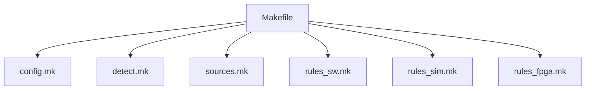
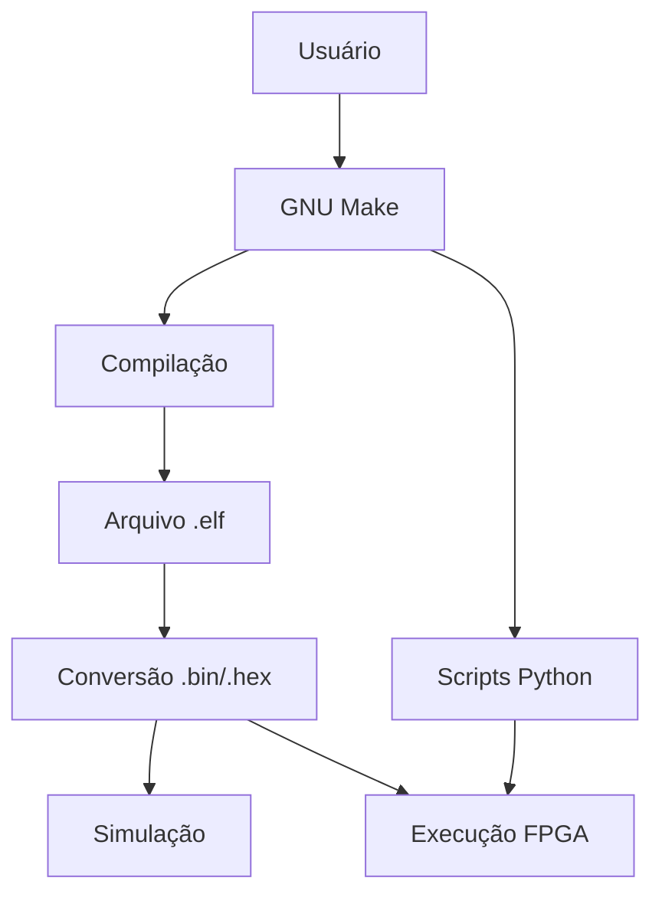

# Infraestrutura de Compilação e Build System (GNU Make)

## Visão Geral

Esta seção documenta a infraestrutura de compilação (*toolchain*) e o sistema de automação de tarefas (*build system*) baseado em GNU Make utilizado no projeto.

O objetivo é descrever, sob uma perspectiva arquitetural, como códigos-fonte escritos em C e Assembly são traduzidos em binários executáveis para a arquitetura RISC-V (RV32I), bem como explicar como o sistema orquestra as etapas de simulação e síntese do hardware.

O Build System atua como um componente central de integração entre:

- o ambiente de desenvolvimento no Host (software);
- a arquitetura do SoC RISC-V na FPGA (hardware);
- os fluxos de simulação e implementação.

Dessa forma, o sistema estabelece uma ponte direta entre software de alto nível e execução em hardware digital, viabilizando a implementação prática de sistemas embarcados.

---

## 1. Cadeia de Compilação RISC-V (Cross-Compilation)

O projeto utiliza o modelo de **cross-compilation**, no qual o código é compilado em uma arquitetura Host (x86_64) para execução em uma arquitetura distinta (RISC-V RV32I).

A toolchain utilizada é baseada no compilador:

```bash
riscv64-unknown-elf-gcc
```

e em ferramentas auxiliares como:

```bash
riscv64-unknown-elf-objcopy
```

Esse modelo é necessário porque o processador alvo do projeto não executa nativamente no ambiente de desenvolvimento do computador hospedeiro. Assim, o Host prepara o software utilizando um compilador capaz de gerar código de máquina compatível com a ISA RISC-V RV32I.

### 1.1 Pipeline de Compilação

```mermaid
flowchart LR

A[C / Assembly] --> B[Pré-processamento]
B --> C[Compilação (GCC)]
C --> D[Assembly RISC-V]
D --> E[Montagem]
E --> F[Objeto (.o)]
F --> G[Linking (link.ld)]
G --> H[Executável (.elf)]
```

### 1.2 Etapas do Processo

#### Pré-processamento

- expansão de macros (`#define`);
- inclusão de bibliotecas (`#include`);
- preparação do código-fonte antes da compilação.

Nessa etapa, o compilador resolve diretivas do pré-processador e gera uma versão expandida do código C.

#### Compilação

- tradução do código C para assembly RISC-V;
- aplicação de otimizações compatíveis com a arquitetura embarcada.

O compilador gera uma representação em assembly alinhada à ISA escolhida, respeitando as flags de arquitetura configuradas pelo Build System.

#### Montagem (Assembling)

- conversão do assembly em código de máquina;
- geração de arquivos objeto (`.o`).

Os arquivos objeto contêm código binário parcial ainda não executável isoladamente.

#### Linking

- combinação dos objetos gerados;
- aplicação do script de ligação (`link.ld`);
- definição explícita do layout de memória do sistema.

Nessa fase, o linker organiza seções como `.text`, `.data` e `.bss`, resolve símbolos entre módulos e posiciona o programa conforme o mapa de memória esperado pelo hardware.

#### Saída Final

- arquivo executável no formato `.elf`.

O `.elf` contém o programa final, símbolos e metadados necessários para inspeção e conversões posteriores.

### 1.3 Configuração da Arquitetura

O sistema utiliza flags específicas para garantir compatibilidade com o hardware:

```bash
-march=rv32i
-mabi=ilp32
```

Essas configurações definem:

- o conjunto de instruções suportado (RV32I);
- o modelo de ABI utilizado;
- o layout de registradores e chamadas de função.

Essa definição é essencial, pois qualquer divergência entre o binário gerado e a microarquitetura implementada no SoC resultaria em incompatibilidade de execução.

---

## 2. Arquitetura Modular

### 2.1 Estrutura Geral



### 2.2 Responsabilidade dos Módulos

- **makefile**: ponto de entrada e definição dos targets principais;
- **mk/config.mk**: definição de variáveis globais, caminhos e flags de compilação;
- **mk/detect.mk**: detecção automática do ambiente e da toolchain;
- **mk/sources.mk**: definição e organização dos arquivos fonte;
- **mk/rules_sw.mk**: regras de compilação do software embarcado;
- **mk/rules_sim.mk**: execução do fluxo de simulação;
- **mk/rules_fpga.mk**: fluxo de síntese, implementação e programação da FPGA.

---

## 3. Configuração e Detecção de Ambiente

### 3.1 `config.mk`

O arquivo `config.mk` centraliza parâmetros fundamentais do Build System. Entre suas responsabilidades estão:

- definir caminhos da toolchain RISC-V;
- configurar flags como `-march=rv32i` e `-mabi=ilp32`;
- padronizar nomes de artefatos gerados;
- manter valores reutilizados por múltiplos módulos.

Na prática, esse arquivo estabelece o contexto global do build e garante consistência entre todas as etapas.

### 3.2 `detect.mk`

O arquivo `detect.mk` é responsável por:

- localizar automaticamente ferramentas como `riscv64-unknown-elf-gcc`;
- detectar o ambiente do sistema operacional;
- configurar variáveis dinâmicas do build.

Esse mecanismo evita dependências rígidas de caminhos fixos e torna o sistema mais portátil entre diferentes máquinas de desenvolvimento.

### 3.3 Relação entre Configuração e Detecção

A combinação entre `config.mk` e `detect.mk` permite que o projeto:

- descubra a toolchain disponível no ambiente;
- propague essas informações para as regras de compilação;
- mantenha o build reproduzível.

---

## 4. Gerenciamento de Fontes (`sources.mk`)

O arquivo `sources.mk` centraliza a definição dos arquivos do projeto.

Funções principais:

- organização de arquivos `.c`, `.s` e VHDL;
- definição de diretórios de entrada;
- abstração da estrutura do projeto para o Make;
- simplificação da expansão automática do conjunto de fontes.

---

## 5. Regras de Software (`rules_sw.mk`)

O arquivo `rules_sw.mk` implementa o fluxo de compilação do software embarcado e constitui o núcleo do processo de geração do programa executado pelo SoC.

### 5.1 Pipeline de Geração


### 5.2 Funcionamento Interno

No `rules_sw.mk`, são definidas regras do tipo:

```make
target: dependências
```

Esse é o mecanismo fundamental do GNU Make. Cada alvo (*target*) depende de um conjunto de arquivos ou artefatos anteriores. Quando uma dependência muda, o alvo correspondente é reconstruído.

No contexto do projeto:

- arquivos `.c` são compilados em `.o`;
- arquivos `.s` são montados diretamente em `.o`;
- o linker combina os objetos usando `link.ld`;
- o resultado é um arquivo `.elf`;
- o `.elf` é convertido em artefatos adequados ao hardware.

### 5.3 Recompilação Incremental

O GNU Make utiliza:

- timestamps dos arquivos;
- grafo de dependências;

para recompilar apenas os artefatos afetados por alterações.

Exemplos:

- alteração em um arquivo `.c` → recompilação do `.o` correspondente;
- alteração em um `.o` → relink do `.elf`;
- alteração em headers ou dependências comuns → recompilação dos módulos afetados.

Esse comportamento é essencial para reduzir tempo de build e tornar o fluxo de desenvolvimento viável.

### 5.4 Relevância para o SoC

No caso deste projeto, `rules_sw.mk` não é apenas uma camada genérica de compilação. Ele conecta diretamente o software C/Assembly às necessidades concretas do hardware digital, preparando binários que serão usados para inicializar memória e executar código no processador RISC-V.

---

## 6. Geração de Artefatos para Hardware

O arquivo `.elf` não pode ser interpretado diretamente pela FPGA nem por grande parte dos ambientes de simulação de memória.

Isso ocorre porque o formato ELF contém:

- cabeçalhos;
- tabelas de símbolos;
- metadados de seções;
- informações auxiliares para depuração e ligação.

O hardware, por outro lado, normalmente requer dados em formato bruto ou textual simples para inicialização de memória.

### 6.1 Conversão com `objcopy`

A extração do conteúdo útil do `.elf` é realizada com:

```bash
riscv64-unknown-elf-objcopy -O binary program.elf program.bin
```

Essa etapa remove a estrutura do executável e preserva apenas os bytes relevantes para execução.

### 6.2 Formatos Gerados

- `.bin` → binário bruto (*raw binary*);
- `.hex` → representação textual adequada para inicialização de memória.

### 6.3 Integração com Hardware

Esses arquivos são utilizados para:

- inicializar a Boot ROM;
- carregar a memória RAM no simulador;
- alimentar o sistema durante simulação ou síntese da FPGA.

Em outras palavras, o Build System converte um executável orientado a software em um formato compreensível pelo hardware digital.

---

## 7. Simulação (`rules_sim.mk`)

O módulo `rules_sim.mk` integra o software ao ambiente de simulação.

Funções principais:

- execução de simuladores (por exemplo, GHDL);
- carregamento de memória com arquivos `.hex`;
- validação funcional do sistema;
- integração com frameworks de teste e automação.

Nesse fluxo, o GNU Make funciona como orquestrador de ferramentas externas, disparando o simulador correto, preparando dependências e organizando a sequência de execução.

---

## 8. Síntese e FPGA (`rules_fpga.mk`)

O módulo `rules_fpga.mk` controla o fluxo de implementação em hardware.

Funções:

- síntese lógica;
- *place-and-route*;
- geração de bitstream;
- programação da FPGA;
- execução de scripts auxiliares, incluindo upload automatizado quando necessário.

Assim, o Build System não se limita ao software: ele também integra o ciclo de implementação física do sistema digital.

---

## 9. Pontes de Automação entre Software e Hardware

Além de compilar código, o Make atua como camada de automação entre diferentes ferramentas do projeto.

Isso inclui:

- chamada de scripts Python para upload ou preparação de artefatos;
- acionamento de simuladores;
- execução de fluxos de FPGA;
- coordenação entre software compilado e infraestrutura de hardware.

### 9.1 Fluxo Global do Sistema



O GNU Make atua como um **orquestrador central**, coordenando:

- compilação do software;
- geração de artefatos;
- execução de simulação;
- chamada de scripts auxiliares;
- programação do hardware.

---

